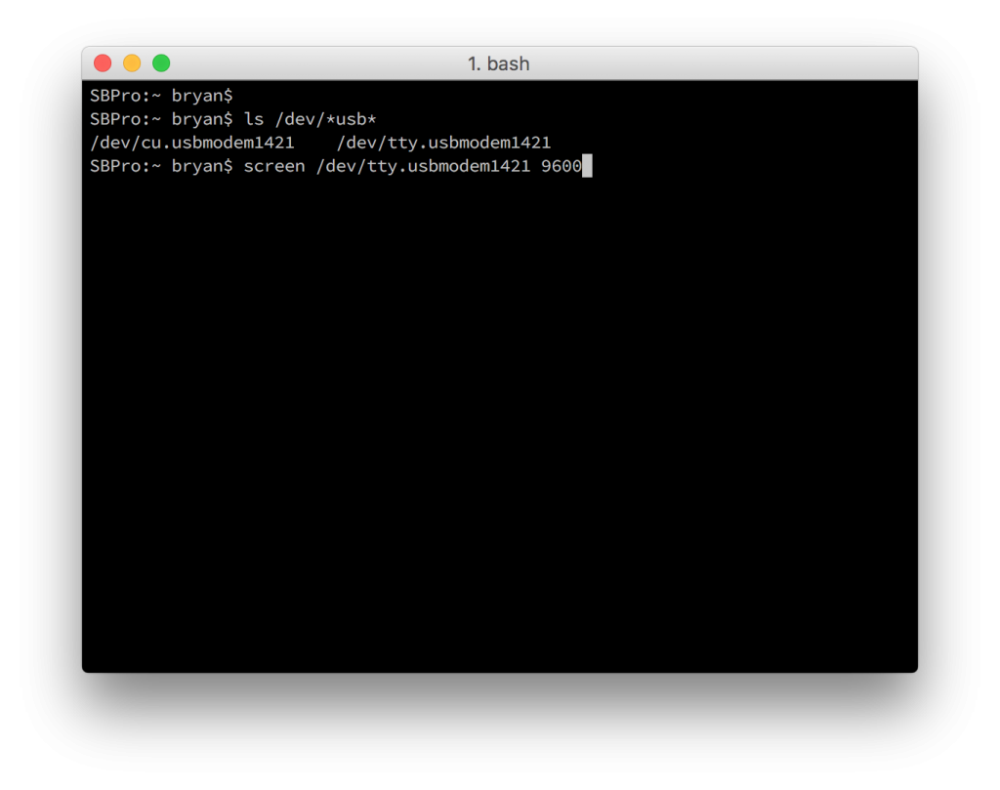
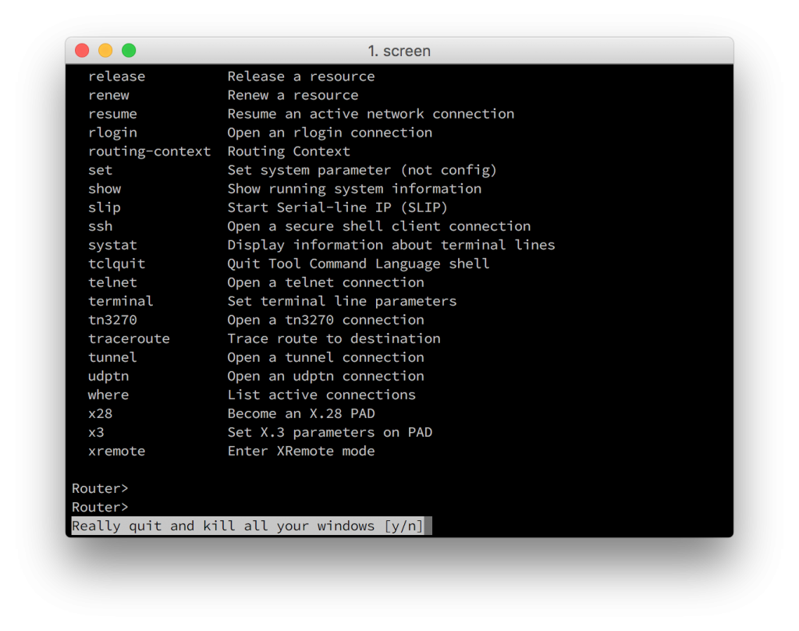
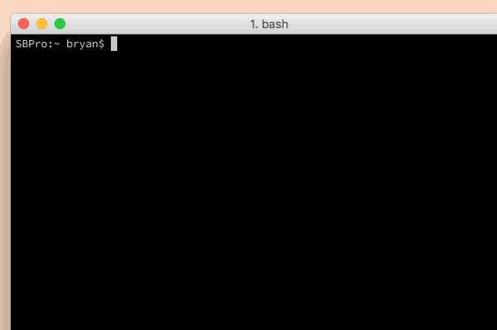

+++
title = "USB Serial Console Cable on OS X"
date = 2016-02-25T23:48:28-04:00
author = "bryan"
draft = false
tags = []
+++
Recently picked up a new usb cable for connecting to my network devices and needed a refresher on connecting to the console.

After installing device drivers (if necessary) and connecting the cable to your mac, open up a terminal and list the contents of your dev directory, filtering for devices with usb in their name.

`ls /dev/*usb*`

Find the proper tty device and use screen to open a connection on the port. You can specify the speed of 9600 but screen will use that value by default.

`screen /dev/tty.usbmodem1421 9600`

You should now find yourself on the console of your network device. To quit screen hold `control-a` and then hit `\`

