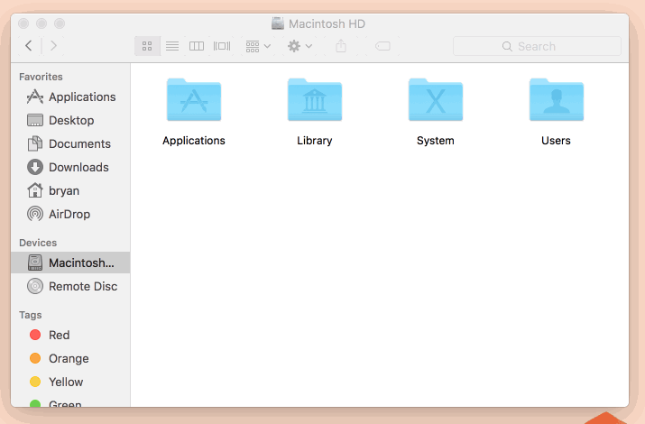
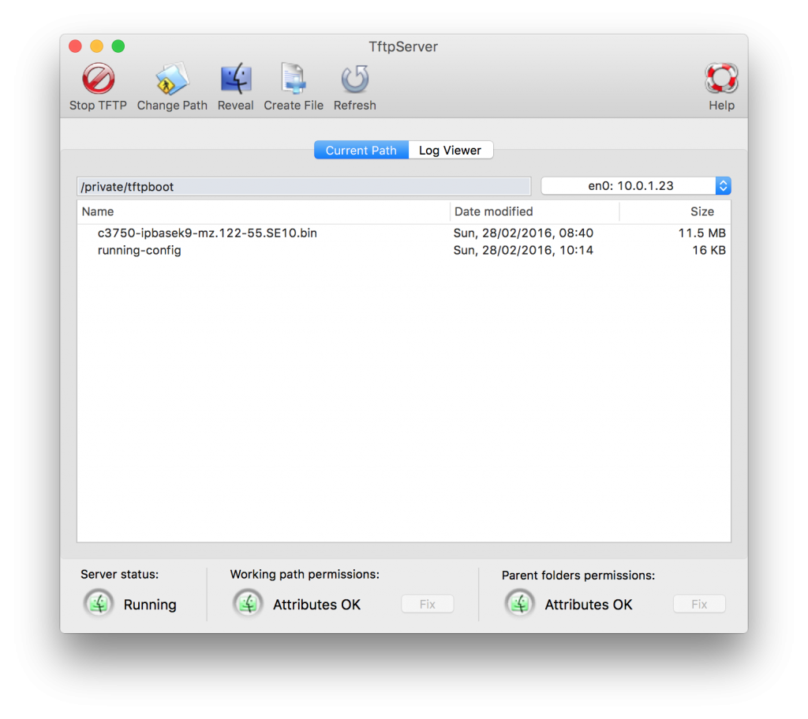

+++
title = "Using the Built in TFTP Server on OS-X El Capitan"
date = 2016-02-28T08:40:54-04:00
author = "bryan"
draft = false
tags = []
+++
On Windows I love the lightweight and open source [TFTPD32](http://tftpd32.jounin.net), but there may come a time when you find youself needing to transfer some files and all you have is your trusty mac.

Luckily there’s a built in tftp daemon that you can use in a pinch.

By default tftpd uses the following folder:

```
/private/tftpboot
```

which is hidden in finder, but can be accessed by using “go to folder” or hitting Command+Shift+G and entering /private/tftpboot



To launch the daemon run the following commands:

```
sudo launchctl load -F /System/Library/LaunchDaemons/tftp.plist
```

Be sure Read/Write/eXecute permissions are set on the tftpboot folder and any files you wish to transfer:

```
sudo chmod 777 /private/tftpboot
```

If you’ll be transferring a file **TO** your TFTP server, the file will technically need to exist on the server beforehand so create it with touch. For example:

```
sudo touch /private/tftpboot/running-config
```

If you’d like a graphical front end for launching tftp then check out the great [TftpServer](http://ww2.unime.it/flr/tftpserver/).



Now go ahead and get transferring.


