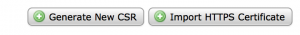
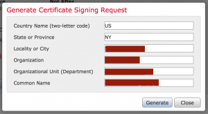
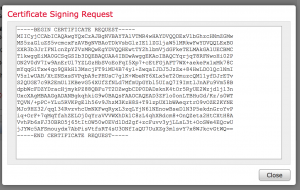
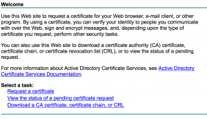
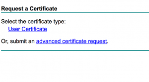
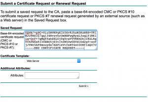
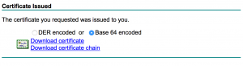
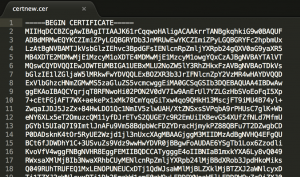
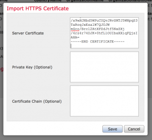
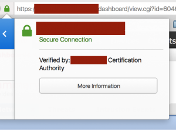

+++
title = "Installing a CA Signed SSL Certificate in SourceFire Defense Center 6.0"
date = 2016-03-02T08:44:37-04:00
author = "bryan"
draft = false
tags = ["firepower"]
+++
I don’t know about you, but self-signed certificates seem to trigger my IT OCD. When possible, I like to replace self-signed certs with one signed by our Active Directory CA. Here are the steps involved to replace the self-signed certificate on Cisco’s FirePOWER Management Center/SourceFire Defense Center with one signed by your internal Active Directory Certificate Authority.

- In Defense Center, go to System -> Configuration -> HTTPS Certificate
- Click “Generate New CSR”

- Fill out the Certificate Signing Request information, paying attention to the common name field. The common name should match the address you use to access defense center, e.g., defensecenter.domain.org

- Click generate, and copy/paste the certificate request output to notepad

- Next, navigate to your Certificate Services website and click “Request a Certificate”

- Click “Submit an advanced certificate request”

- Under “Saved Request,”paste your certificate request output from earlier and select the Web Server certificate template. Click Submit

- Download your newly generated certificate (Base64 encoded) and open it with your text editor of choice

- Copy the output of your cert and go back to Defense Center. Navigate to System -> Configuration -> HTTPS Certificate
- Click Import HTTPS Certificate and paste your certificate information into “Server Certificate”

- Click “Save” and you should now see your new certificate installed.
- Reload Defense Center and you should now trust the web server (assuming of course you trust the root CA)

