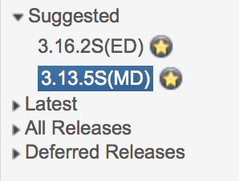
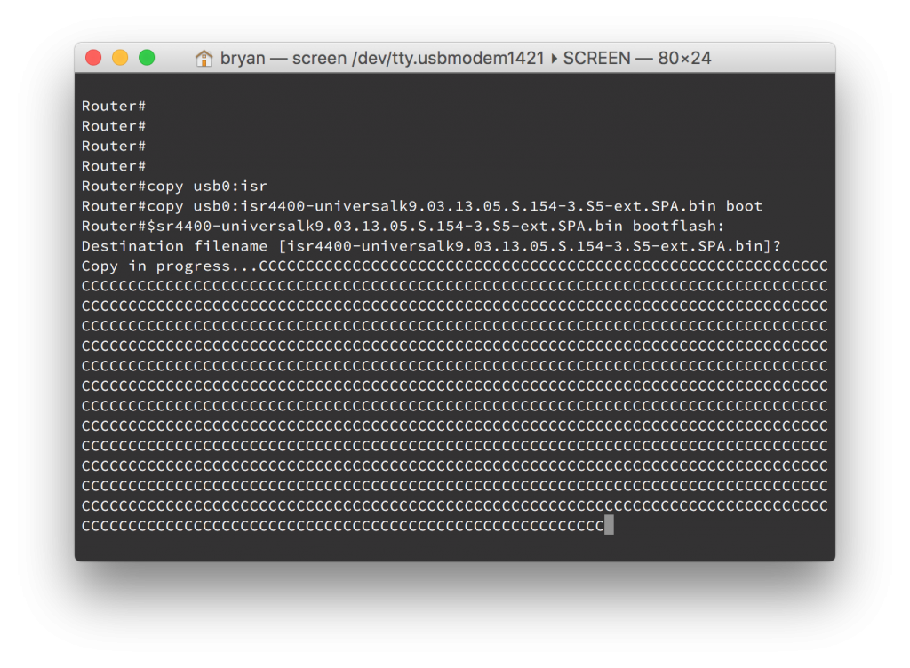

+++
title = "Upgrading IOS-XE on a Cisco ISR 4400"
date = 2016-03-03T08:52:04-04:00
author = "bryan"
draft = false
tags = ["IOS-XE"]
+++
Just got in a new Cisco ISR 4431 and needed to upgrade IOS-XE out of the box. Cisco has been nice enough to include a 1Gb USB flash drive with their new ISRs, making the software upgrade process a cinch. Here are the steps involved to install a new version of IOS-XE via USB drive.

- Download your chosen version of IOS-XE from cisco.com. Keep in mind there are often may different trains and revisions of code available.
    - To help you decide which version of code is right for you, there’s the cisco IOS feature navigator found [here](http://tools.cisco.com/ITDIT/CFN/jsp/compareImages.jsp).
    - To help differentiate the different designations of code, i.e., MD, ED, GD, take a look [here](https://www.cisco.com/public/library/iosplanner/reldesignation.html).
    - Typically I opt for a gold star release, which are cisco recommended releases “based on software quality, stability and longevity.”

the downloaded image to your USB drive and insert it into the ISR

- Copy the IOS-XE image from the usb to the ISR’s bootflash
    - `copy usb0: bootflash:`

onfiguration mode and set the ISR to boot from the new image
    - `conf t`
    - `boot system flash bootflash:isr4400-universalk9.03.13.05.S.154-3.S5-ext.SPA.bin`
- Verify the correct boot system parameters
    - `show run | include boot`
- Save your configuration
    - `copy running-config startup-config`
- Reload the ISR
    - `reload`

s reloading, verify that the device is running the correct version of IOS-XE
    - `show version`

This type of software installation is referred to as a consolidated package. Cisco also supports the installation of individual packages from an IOS-XE image. To see Cisco’s full documentation for software configuration on an ISR 4400 as well as instructions for consolidated and individual package installs please see [here](http://www.cisco.com/c/en/us/td/docs/routers/access/4400/software/configuration/guide/isr4400swcfg/bm_isr_4400_sw_config_guide_chapter_0101.html).