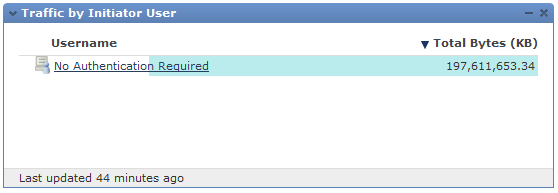
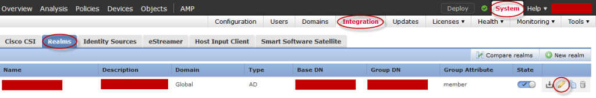
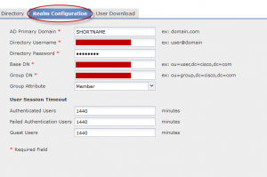

+++
title = "Usernames No Longer Appear in Firepower Management Center After Upgrading to 6.0"
date = 2016-03-07T08:53:30-04:00
author = "bryan"
draft = false
tags = ["firepower"]
+++
After upgrading our Firepower Management Center to 6.0, we noticed that usernames were no longer populating in our dashboards. Instead of showing users, all we could see was “No Authentication Required.”

After opening a support case, TAC pointed me to the following bug: [cscux39125](https://bst.cloudapps.cisco.com/bugsearch/bug/cscux39125) (cisco login required).

To resolve the issue we need to set the active directory domain to our domain’s NetBIOS short name in Firepower’s realm configuration.

To change your realm configuration go to **System** -> **Integration** -> **Realms**

Click **Edit**

Go to **Realm Configuration** and edit the AD Primary Domain field to your domain’s NetBIOS short name.

For more information see the following support forums post: [https://supportforums.cisco.com/discussion/12879381/sourcefire-60-firesight-mc-60-users-not-populating](https://supportforums.cisco.com/discussion/12879381/sourcefire-60-firesight-mc-60-users-not-populating)