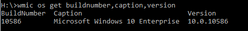
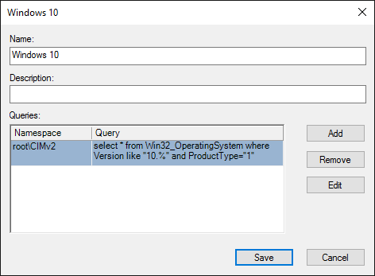
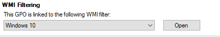
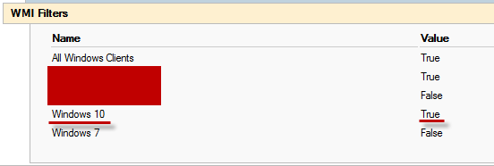

+++
title = "Windows 10 WMI Filter for Group Policy"
date = 2016-03-08T08:55:15-04:00
author = "bryan"
draft = false
tags = ["windows"]
+++
Windows 10 devices have started to trickle into our production environment and I needed a quick way to apply Windows 10 specific policies to these computers.

By creating a WMI filter that looks for the Windows 10 version number and then linking that query to our Windows 10 group policies, we can ensure that only Windows 10 PCs will get the policies we want.

First we use the command line utility ‘[wmic](https://msdn.microsoft.com/en-us/library/bb742610.aspx)‘ to find out what version of Windows wmi is reporting. (Make note of the version number, quite a jump from previous versions of windows; Windows 7 used 6.1, Windows 8 used 6.2, and Windows 8.1 used 6.3)

- `wmic os get buildnumber,caption,version`

- Open **Group Policy Management** and expand **Domains** -> **your Domain** -> **WMI Filters**
- Right click **WMI Filters** and select **New**
- Enter a name for the filter, I went with the descriptive “Windows 10,” and then click **Add**
- Namespace should say `root\CIMv2` and under query we’ll enter the following `select * from Win32_OperatingSystem where Version like "10.%" and ProductType="1"`

- Click **OK** and then **Save**
- Now find the policy that you want to apply the filter to and look for the section at the bottom that says **WMI Filtering**
- Click the drop down box and select your new Windows 10 WMI Filter

---

You can validate that the WMI filter worked correctly by running a group policy results report on a Windows 10 PC that would receive the policy.

Look at the **details** tab of the report and then under WMI Filters

