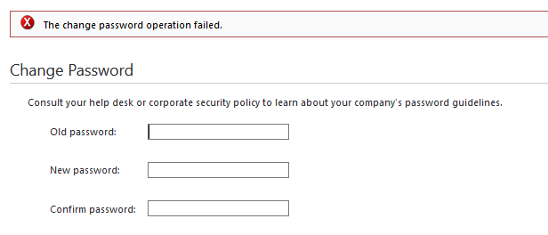
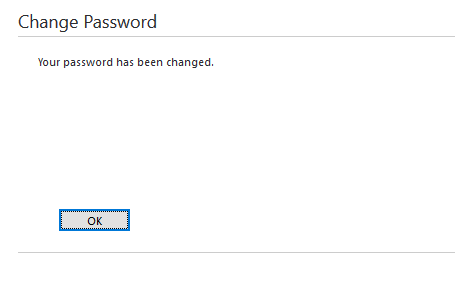

+++
title = "Fix for The Change Password Operation Failed Error on XenApp 6.5"
date = 2016-03-09T08:57:20-04:00
author = "bryan"
draft = false
tags = ["citrix"]
+++
After running February 2016’s batch of Microsoft security updates, we started receiving calls from end users about errors when attempting to update their passwords through the Citrix web interface.

While the error indicates the password change failed, it does in fact work, and users can log out and log back in with the new password.

Thankfully it didn’t take long for some savvy Citrix support forums users to pinpoint the issue to a recent patch Microsoft released which changes the api behavior for NetUserChangePassword.

[http://discussions.citrix.com/topic/375446-help-wi-error-when-user-changes-password/](http://discussions.citrix.com/topic/375446-help-wi-error-when-user-changes-password/)

Uninstalling patches KB3126587 or KB3126593 from your Citrix XML brokers will resolve the [issue](http://support.citrix.com/article/CTX206941), **but** on March 8th 2016, Microsoft released a security update which addresses the problem.

Simply install the new patch on your XML brokers –**which does require a reboot!**– and you should be good to go.

See Citrix’s updated support article below, along with Microsoft’s patch information.

[http://support.citrix.com/article/CTX207802](http://support.citrix.com/article/CTX207802)

[https://support.microsoft.com/en-gb/kb/3140410](https://support.microsoft.com/en-gb/kb/3140410)

