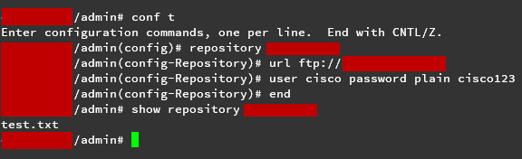
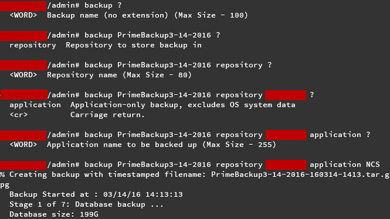
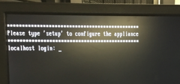
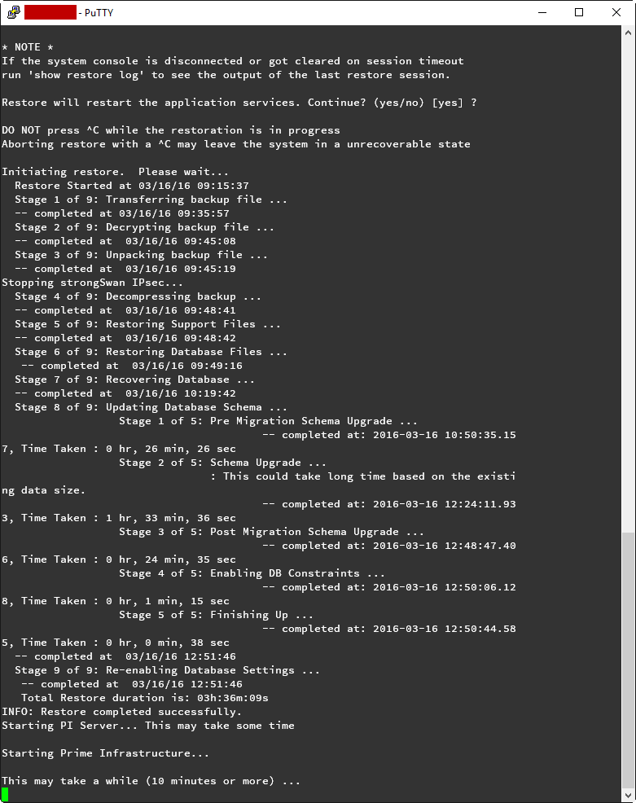
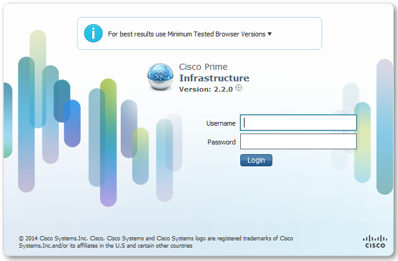

+++
title = "Upgrading Cisco Prime Infrastructure 2.1 to 2.2"
date = 2016-03-16T09:08:11-04:00
author = "bryan"
draft = false
tags = ["cisco"]
+++
At the moment we’re running Cisco Prime Infrastructure 2.1 on a Gen1 physical appliance. We’re looking to take the upgrade path from 2.1 all the way up to 3.1 (currently only 3.0.2 is supported on the Gen1 appliance).

First stop, 2.2.

The Gen1 appliance upgrade path isn’t a fun one. It requires that we back up our current application database, wipe our appliance, do a bare-metal install of 2.2, and then restore our application database. Cisco’s documentation for application backup and restore can be found here: [http://www.cisco.com/c/en/us/td/docs/net_mgmt/prime/infrastructure/2-2/administrator/guide/PIAdminBook/backup_restore.html#72460](http://www.cisco.com/c/en/us/td/docs/net_mgmt/prime/infrastructure/2-2/administrator/guide/PIAdminBook/backup_restore.html#72460)

---

**Step one  
**

Back up the PI application database to an FTP repository (I recommend [FileZilla Server](https://filezilla-project.org/download.php?type=server) for hosting a light-weight FTP server on your workstation).

- Create a ftp repository on your Prime Infrastructure server via CLI
    - SSH to PI
    - `conf t`
    - `repository _NAME_`
    - `url ftp://x.x.x.x`
    - `user _username_ password plain _password_`
- Verify your repository configuration
    - `show repository _NAME_`

- Backup your Prime Infrastructure application
    - `backup _backup-name_ repository _repository-name_ application NCS`

---

**Step two**

Install Prime Infrastructure 2.2

Reboot your appliance from the PI 2.2 installation media and follow the on-screen configuration prompts. For more information follow Cisco’s [Installation Guide](http://www.cisco.com/c/en/us/td/docs/net_mgmt/prime/infrastructure/2-0/install/guide/Cisco_PI_Hardware_Appliance_Installation_Guide/cpi_higmain.html#pgfId-1061175)

**Step three**

Restore your application database

- SSH to the Prime Infrastructure server and setup your ftp repository again
    - `conf t`
    - `repository _NAME_`
    - `url ftp://x.x.x.x`
    - `user _username_ password plain _password_`
- Verify your repository configuration, and check that your backup is there
    - `show repository _NAME_`

- Run the restore command, taking note of the scary warnings
    - `restore _BACKUP_NAME.tar.gpg_ repository _REPOSITORY_NAME_ application NCS`

