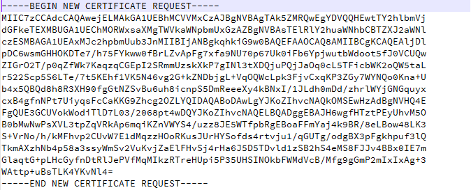
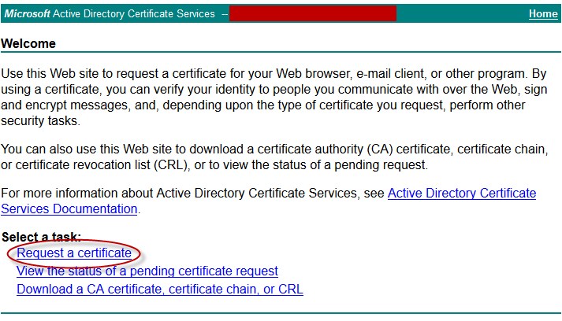
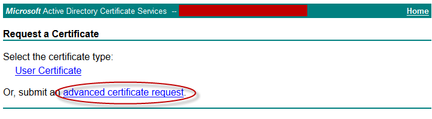
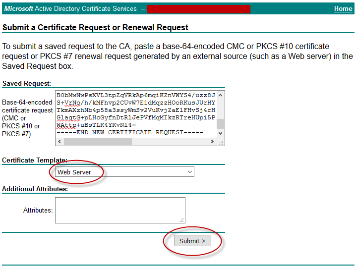
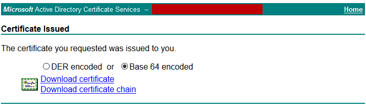
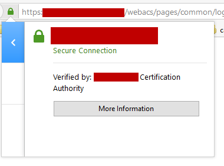

+++
title = "Installing a CA Signed Certificate in Cisco Prime Infrastructure 2.2"
date = 2016-03-20T09:12:39-04:00
author = "bryan"
draft = false
tags = ["cisco"]
+++
After following the Prime Infrastructure upgrade path to 2.2 you’ll need to re-issue CA signed certificates. Unfortunately, this can’t be accomplished from the Web GUI and will need to be done via the CLI.

Here’s Cisco’s [documentation](http://www.cisco.com/c/en/us/td/docs/net_mgmt/prime/infrastructure/2-2/administrator/guide/PIAdminBook/config_server_settings.html#pgfId-1112683) for installing CA-Signed Certificates and the steps I used to import a new certificate from our Active Directory Certificate Services server.

- First you’ll want to SSH to your Prime Infrastructure server as well as create a FTP server on your workstation. See my [previous blog post](https://wrmem.net/index.php/2016/03/16/upgrading-cisco-prime-infrastructure-2-1-to-2-2/) for instructions how to do so.
- Generate a new CSR file and answer the information prompts
    - `PIServer/admin# ncs key genkey -newdn -csr CSRFile .csr repository defaultRepo`
    - `The NCS server is running. Changes will take affect on the next server restart   Enter the domain name of the server: (the fqdn you'll use to access prime from e.g., prime.company.org)   Enter the name of your organizational unit:   Enter the name of your organization:   Enter the name of your city or locality:   Enter the name of your state or province:   Enter the two letter code for your country:   Generating RSA key`
- Copy the CSR to your FTP server
    - `PIServer/admin# copy disk: /defaultRepo/ CSRFile.csr ftp://your.ftp.server`
- Open your CSR in a text editor, copying the text to your clipboard

- Navigate to your internal CA and click **Request a certificate**

- Click **Submit an advanced certificate request**

- Under “Saved Request,”paste your certificate request output from earlier and select the Web Server certificate template. Click Submit

- Download your certificate and copy it to your FTP server directory

- Copy the certificate from the FTP server to the default repository
    - `PIServer/admin# copy ftp://your.ftp.server/CertFile.cer disk:defaultRepo`
- Import the certificate into the Prime Infrastructure server
    - `PIServer/admin# ncs key importsignedcert CertFile.cer repository defaultRepo`
- Restart Prime Infrastructure
    - `ncs stop`
    - `ncs start`
- When the server comes back up, reload the web page and you should notice that the site is now trusted!

