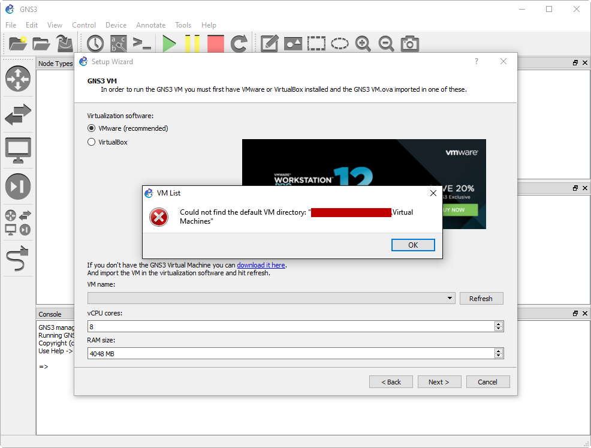
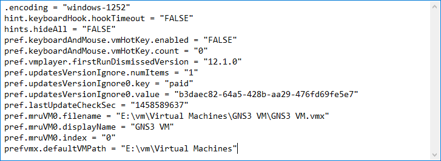
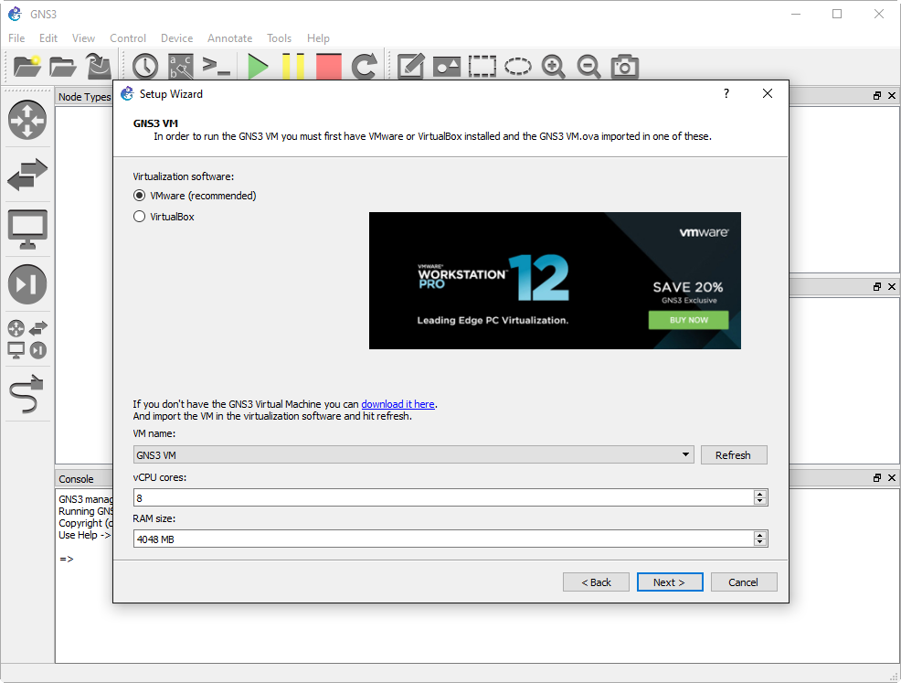

+++
title = "GNS3 VM and VMware Workstation 12 Player Could not find the default VM directory"
date = 2016-03-22T09:17:29-04:00
author = "bryan"
draft = false
tags = ["lab"]
+++
While setting up the new GNS3 1.4 Virtual Machine with VMware Workstation 12 Player, I ran into an interesting error that was preventing me from completing the installation.

Thankfully the fix is fairly straight forward and requires that we edit the VMware Workstation preferences file.

- Open **preferences.ini** in your text editor of choice
    - `%Appdata%\VMware\preferences.ini`
- Add or edit the following line, changing the path to where your virtual machines are stored
    - `prefvmx.defaultVMPath = "C:\Path\To\My\VMs"`
- And that’s it. Save the ini and restart the GNS3 Setup Wizard.

Credit to the VMware support forums: [https://communities.vmware.com/thread/245114?start=0&tstart=0](https://communities.vmware.com/thread/245114?start=0&tstart=0)