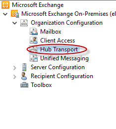
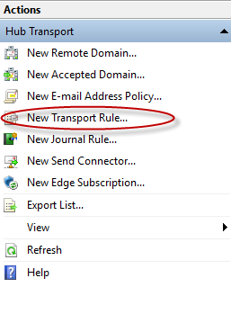
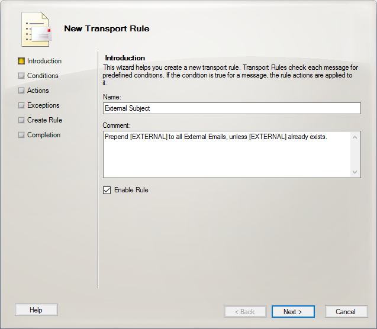
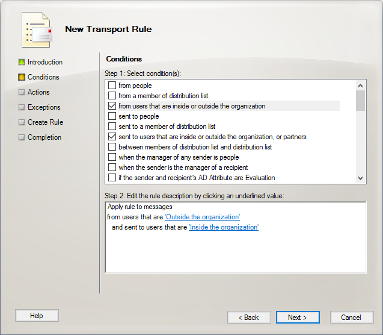
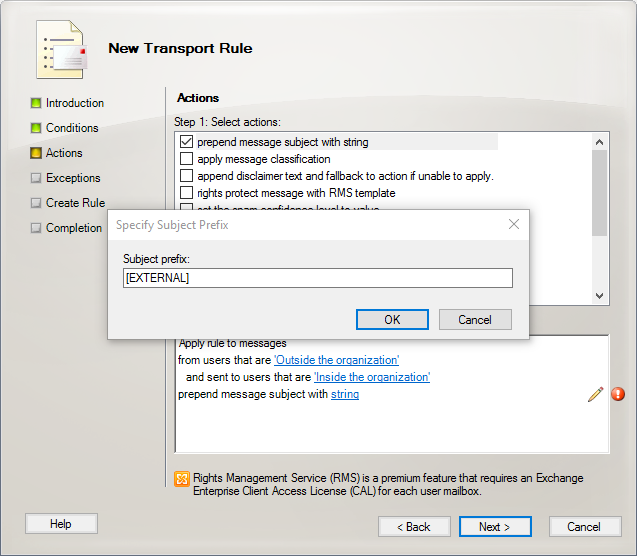
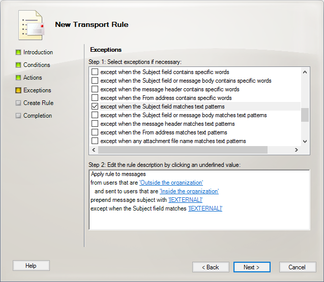
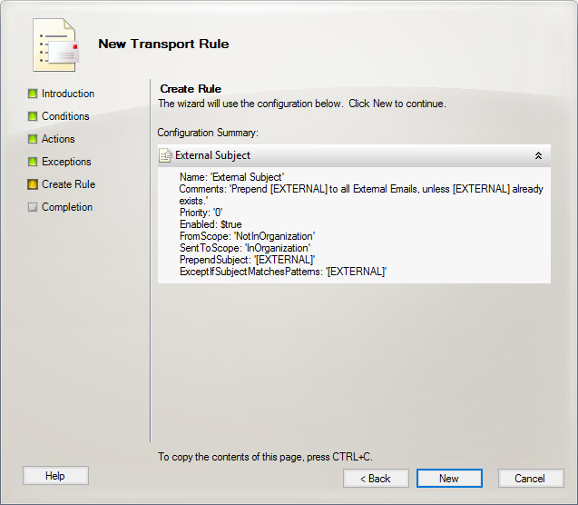
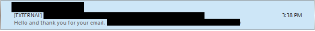

+++
title = "Creating a Subject Line Disclaimer in Exchange 2010"
date = 2016-04-12T09:19:15-04:00
author = "bryan"
draft = false
tags = ["exchange"]
+++
With ever increasing amounts of spam and spear phishing attacks, many companies today are going out of their way to warn users when an email is received from an external, and potentially unsafe, source. Thankfully the Exchange Management Console makes it fairly straight forward to create transport rules to add disclaimers, re-write subject lines, and even insert html into emails for all types of situations.

Recently I was asked to add an [EXTERNAL] tag to the subject line of all incoming emails from outside the organization. Below are the steps to create a Hub Transport rule to accomplish such a task.

- Open the **Exchange Management Console**
- Navigate to **Organization Configuration** -> **Hub Transport**

- On the right side of the console click “**New Transport Rule…**“

- The **New Transport Rule** wizard will open. Simply follow the onscreen instructions, entering a name and comment for the rule. Click **Next** when finished.

- Under **Conditions**, select “**from users that are inside or outside the organization**” and “**sent to users that are inside or outside the organization, or partners.**” Click the blue links under Step 2 to change the from users field to “**Outside**” and the sent to users field to “**Inside**.” Click **Next** when completed.

- Under actions, check “**prepend message subject with string**.” Click the blue link next to “**string**” to edit the subject prefix. Enter the tag that you’d like to appear in the subject line. Click **OK** and **Next**.

- Under **Exceptions** click “**except when the Subject field matches text patterns**.” Click the blue link next to “**string**” and added the same prefix you added in the previous step. This will prevent multiple subject stamping from occurring when people email back and forth. Click **Next**.

- Click **New** to create your new transport rule.

- Emails from an external source should now have a new tag in the subject line.

