+++
title = "Zero Downtime ASA Upgrade - ASDM"
date = 2016-04-29T09:22:42-04:00
author = "bryan"
draft = false
tags = ["cisco","asa"]
+++
Take a look [here](http://www.cisco.com/c/en/us/td/docs/security/asa/asa95/asdm75/general/asdm-75-general-config/admin-swconfig.html#ID-2152-0000019f) for Cisco’s official documentation, which will be the blueprint for our guide.

- First, back up your configuration by going to **Tools** -> **Backup Configurations**

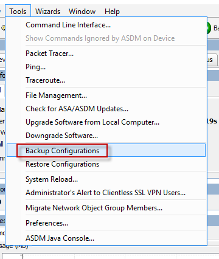

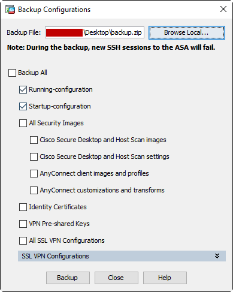

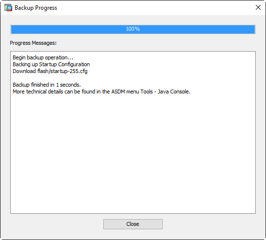

- Download your updated ASDM and ASA software from [Cisco.com](https://software.cisco.com/download/navigator.html?i=%21mmd)
- Click **Tools** -> **Upgrade Software from Local Computer**

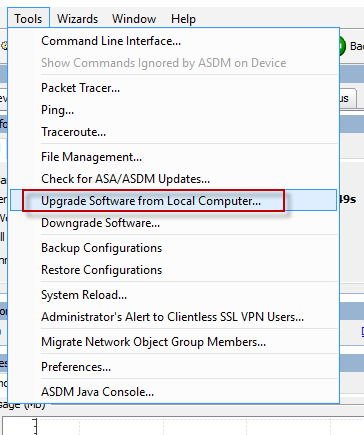

- We’ll update ASDM first, select **ASDM** from the drop down box and click **Browse Local Files**. Navigate to where you downloaded your images and select the new ASDM image then click **Upload Image**.

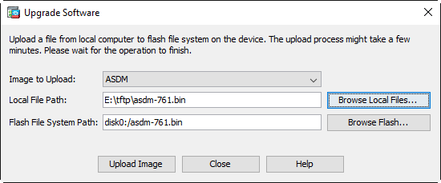

- You will receive a prompt asking to set this image as the ASDM image. Click **No** for now. If we select Yes you will not be able to use ASDM to connect to the secondary unit and upload the new images in the later steps.

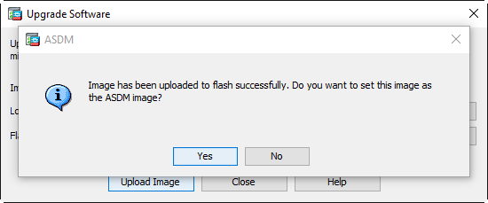

- Now let’s update the ASA software. Again, click **Tools** -> **Upgrade Software from Local Computer**. Select ASA from the drop down menu and click **Browse Local Files**. Navigate to where you downloaded your images and select the new ASA image then click **Upload Image**. Click yes on the prompt.

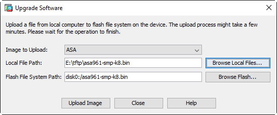

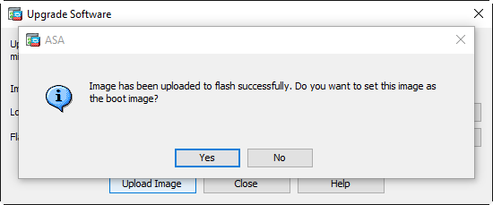

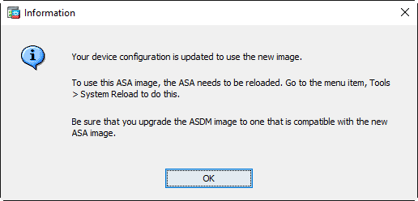
- Open a new ASDM window and connect to the standby ASA IP address. Follow the same steps as above to upload the new ASDM and ASA images. Close the ASDM window for the secondary unit when finished.
- On the Primary ASDM window click **Configuration** -> **Device Management** -> expand **System Image/Configuration** -> click **Boot Image/Configuration**. Under **ASDM Image File Configuration** click **Browse Flash** and select our new ASDM image we uploaded earlier. Save the configuration.

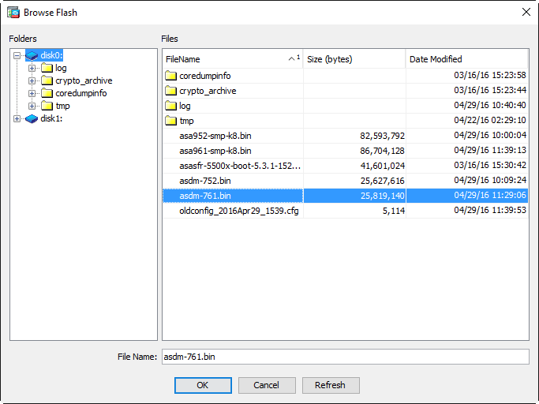

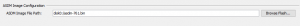
- We can now reload the secondary unit to start the upgrade process. Click **Monitoring** -> **Properties** -> **Failover** -> **Status**. Click **Reload Standby**.

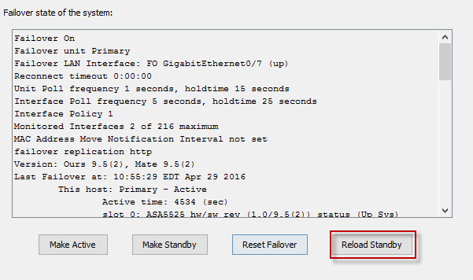

- Refresh the Failover Status page until the Secondary unit moves from a failed state to standby ready. Make note of the sw rev field. It should reflect the new ASA software version.

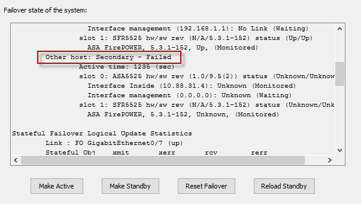
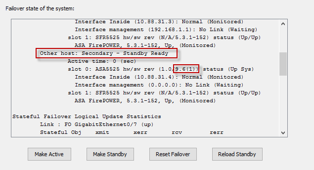

- Force the active unit to failover to standby by clicking the **Make Standby** button on the Failover Status page. Refresh the Failover Status page to verify the Secondary unit is now the active unit. Now click **Reload Standby** to reboot the primary/standby unit and complete the upgrade.

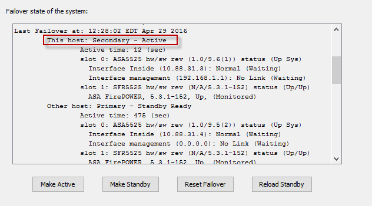

- Exit ASDM and relaunch. You should now see the updated ASDM and ASA software versions under Device Information.

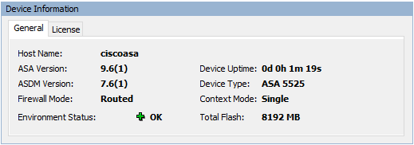