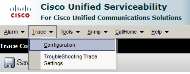

+++
title = "Troubleshooting TFTP Issues with Cisco Unified Real Time Monitoring Tool - RTMT"
date = 2016-06-28T09:27:41-04:00
author = "bryan"
draft = false
tags = ["cisco"]
+++
I’ve recently began studying for my CCNA Collaboration exam and to help with my studies I’ve built a small collaboration lab. Nothing too fancy, a 2811 with PVDMs and FXO/FXS cards, 2 3750 PoE switches, and 2 Cisco 7960 VOIP phones. My lab server has a dedicated NIC which connects to the lab network and hosts a domain controller, workstation, and CUCM 11.5 virtual machines.

All this was working well until I configured the switches to have a separate dedicated voice VLAN. The phones started having issues contacting CUCM and downloading new configuration files or firmware. If I moved the phones back to the same VLAN as CUCM the phones would work properly. Sounded like a TFTP issue to me, and here are the steps I followed to resolve the issue.

[TLDR; ip tftp source-interface](http://www.firewall.cx/cisco-technical-knowledgebase/cisco-routers/882-cisco-ip-tftp-source-interface.html)

First, I setup a trace to capture TFTP logs from my CUCM server.

- From the CUCM Console: select **Cisco Unified Serviceability** from the Navigation drop down, and click **Go**.


- On the **Cisco Unified Serviceability** page select **Trace** -> **Configuration**


- Select your CUCM Server running the TFTP service for **Server** then select **CM Services** under **Service Group**.
- For **Service** select **Cisco Tftp** then click **Go**.
- Be sure **Trace On** is selected then change the **Trace Level** to **Detailed**.
- Click **Save**.


With the detailed TFTP trace enabled, I tried resetting the phones to duplicate the issue. Once I verified the issue was still occurring it was time to grab the trace files.

To download the trace files you’ll need to use the **Cisco Unified Real-Time Monitoring Tool** which comes bundled with CUCM. To download the tool, follow these steps.

- From the CUCM Administration page navigate to **Application** -> **Plugins**.


- Near the bottom of the plugins page find the download link for Cisco Unified Real-Time Monitoring tools.
- Download the tool for your appropriate os and install.


- When you run the program it will ask you for the IP of the CUCM server and the GUI username/password.


- Select **Trace & Log Central**. Then double click **Collect Files**.


- Scroll down to find **Cisco Tftp** and select either All Servers or an individual server.


- Select your download options and click **Finish**.


You should now have a wealth of information to dive into to try and troubleshoot your issue. As I was perusing the TFTP trace logs a few lines popped out at me.


It would appear that the phone is contacting the TFTP server, but its IP address was not part of my voice VLAN. In fact, the source IP was the IP of the outside interface of my 2811!

After some quick google’ing I came across [this article](http://www.firewall.cx/cisco-technical-knowledgebase/cisco-routers/882-cisco-ip-tftp-source-interface.html) on the ip tftp source-interface command. Because my router was sourcing TFTP traffic from its outside interface, CUCM was not able to route the traffic back to 7960 phone.

Simply adding the **ip tftp source-interface** command followed by the VLAN my CUCM server resided in resolved the issue and my phones began registering again.
```

COLLAB-SW-01(config)#ip tftp source-interface vlan 103
COLLAB-SW-01(config)#end
COLLAB-SW-01#wr
Building configuration...
[OK]
COLLAB-SW-01#

```
