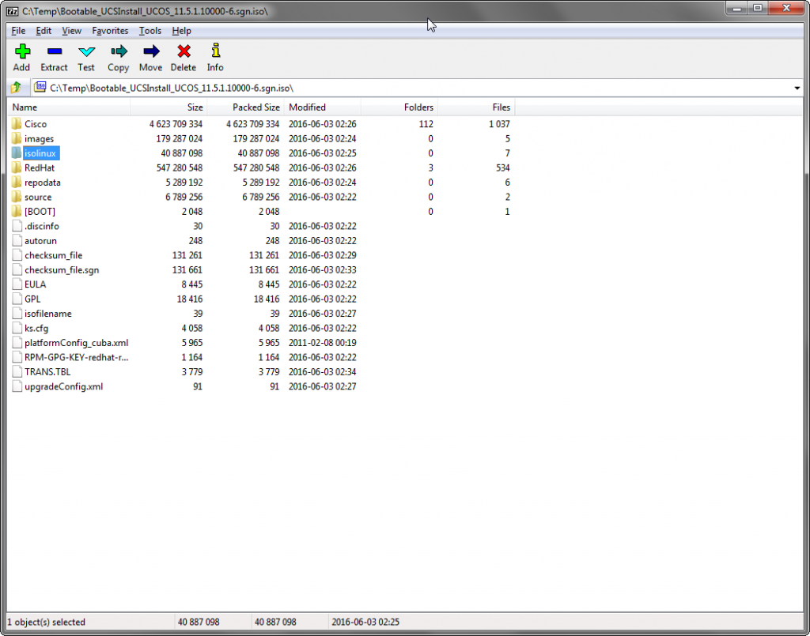
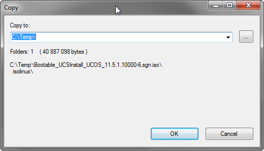
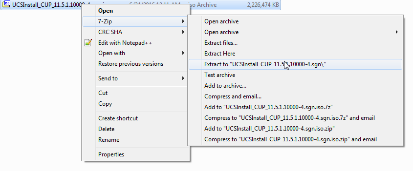
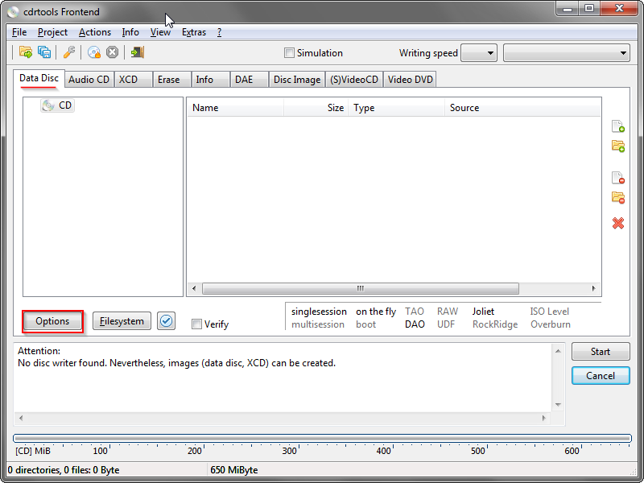
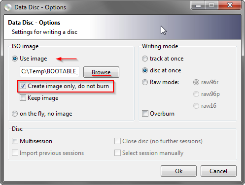
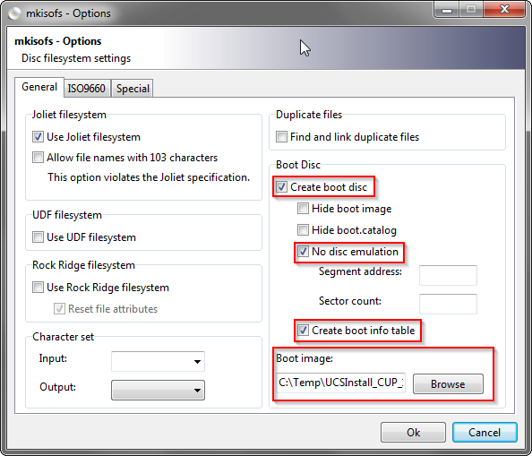
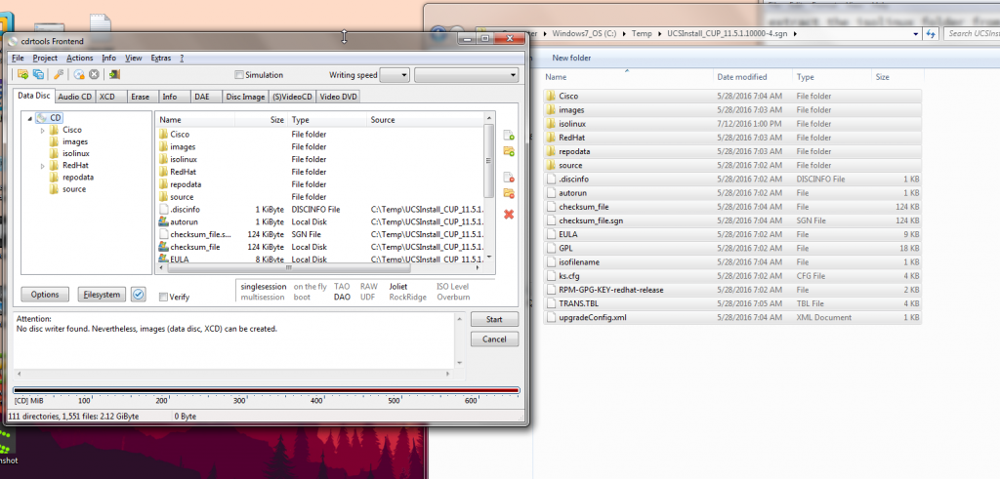
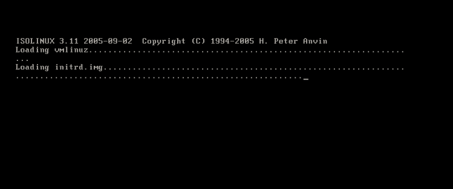

+++
title = "Creating a Bootable ISO from Cisco Non-Bootable Updates"
date = 2016-07-13T09:33:00-04:00
author = "bryan"
draft = false
tags = ["cisco"]
+++
There’s plenty of great posts out there on how to make bootable CUCM/Collaboration media with paid GUI software such as [UltraISO](http://htluo.blogspot.com/2010/04/how-to-make-non-bootable-iso-image.html) or free command line utilities like [cdrtools](http://www.ipcommute.co.uk/technical-articles/17--creating-isolinux-boot-dvds-with-free-software-cucm-uccx-cups.html). Inspired by those bloggers, I wanted to share a method to create bootable media that features the best of both worlds: open source utilities with easy to use interfaces, all for the low low price of free.

Software you’ll need:

[7-Zip](http://www.7-zip.org/) / [cdrtfe](http://cdrtfe.sourceforge.net/)

First, find an existing bootable CUCM ISO (a Red Hat or CentOS live cd will do the trick as well) and open it in 7zip.

Find the **isolinux** directory, highlight it, and click **Extract**. Choose where to save the files.

Next, take your non-bootable update dvd from Cisco and extract the contents with 7zip by right clicking the ISO -> 7-Zip -> Extract to….

Copy the **isolinux** directory you extracted earlier to the newly extracted Cisco ISO folder, overwriting any duplicate files.

Now open **cdrtfe**. Under the **Data Disc** tab click **Options**.

Under **ISO image**, select **Use image**, and browse to a location to store the finished ISO. Check **Create image only, do not burn**. Click **Ok**.

Next, click the **File System** button. Check the following options: **Create boot disc**, **No disc emulation**, and **Create boot info table**. Under the **Boot image** field, browse to the copied **isolinux** directory of your extracted ISO folder and select **isolinux.bin**. Click **Ok**.

In file explorer, browse to your extracted ISO folder and copy over all the files and folders into the cdrfte window.

Click **Start** to create your ISO. Once completed you should have a fully bootable ISO!

