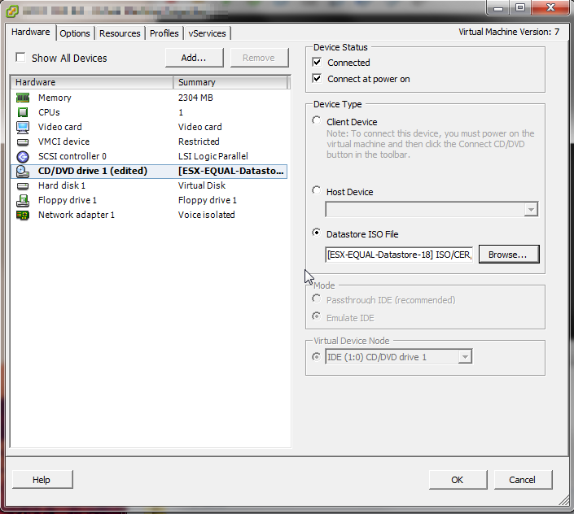

+++
title = "Upgrading Cisco Emergency Responder 8.6 to 10.5 - Physical to Virtual"
date = 2017-04-28T09:46:32-04:00
author = "bryan"
draft = false
tags = ["cisco"]
+++
I was recently tasked with upgrading Cisco Emergency Responder 8.6 to 10.5. The 8.6 install just so happened to be on a physical IBM MCS server so I thought I’d document the steps of upgrading a physical install of CER 8.6 to a virtual CER 10.5 install, along with the software used to complete the upgrade.

- Log in to **Disaster Recovery System** by selecting it from the drop down box located on the top right of the CER login page and clicking **Go**.

- Select the **Backup Menu** and then navigate to **Backup Device**.

DRS uses SFTP to securely transport the backup records. If you have a SFTP server already setup in your environment you can use that to create a manual up-to-date back up. For this upgrade, a SFTP server was unavailable so I had to use my laptop as the back up device. The software I used to accomplish this task was [freeSSHd](http://www.freesshd.com/?ctt=overview). These next steps are an overview on how to configure freeSSHd as a backup device for DRS.

- Open freeSSHd and click the **Users** tab and then click **Add** to configure a backup user.

- Click the SFTP tab and set the SFTP home path, the directory where the backup files will be stored.

Now that freeSSHd is configured we can go back to DRS and configure the Backup Device.

- Give the Backup device a name, IP, path, and the username and password you configured in freeSSHd.

- Once the backup device is configured click the **Backup** menu and select **Manual Backup**.

- Select the device you configured and click CER to back up all registered CER components.

- Click **Start Backup**, if everything is configured successfully you should see the progress bar advance and a number of tar archives will now be in your SFTP directory.

With a backup of the existing physical 8.6 install in place, we can now migrate to a virtual install of CER 8.6. The vmware ova and install media for CER 8.6 are unfortunately not on the Cisco downloads page. However, if you open a TAC case for assistance with a P2V migration, Cisco will make the download available to you.

After you import the 8.6 ova you may also want to adjust the virtual machine properties so that CER 10.5 will be supported without issues. Increasing the memory to 4 GB, increasing the CPU resources, etc.

Follow the on screen instructions to complete the basic CER install (if you want re-IP CER, now would be the time to do that, or if you want to keep the same IP address please be sure that the virtual CER is on an isolated network). Once completed head to the web interface and select **Disaster Recovery System**.

- Create your backup device on the by going to **Backup** > **Backup Device**.

- Go to the **Restore** menu and select **Restore Wizard**.

- Select your **Backup Device** and click next.

- Select your **Backup Archive** and click next.

- Select the features you’d like to restore and click next.

- Select **File integrity check** and the servers to be restored then click **Restore**.

- 
- Wait for the restore process to finish. Once completed you will need to reboot the virtual machine by SSH’ing into the server and issuing the **utils system restart** command.

- Next we can begin the upgrade process. Select **Cisco Unified OS Administration** from the navigation drop down menu and click Go. Select the **Software Upgrades** menu and click **Install/Upgrade**.

- First we need to install ciscocm.cer_refresh_upgrade_v1.1.cop.sgn, a Cisco Options Package that is necessary to upgrade from 8.6 to 10.5. The file can be downloaded from Cisco and will need to be placed in your SFTP directory.
- Select **Remote Filesystem** as the software source.
- Configure the **Software Location** to point to your PC running freeSSHd then click next.

- Under **Software Location** select ciscocm.cer_refresh_upgrade_v1.1.cop.sgn and click next.

- You should then see the install progress.

- Reboot the system.

- Next, mount the 10.5 install media on the virtual machine. Select **Connected** and **Connected at power on**.

- Select **Cisco Unified OS Administration** from the navigation drop down menu and click **Go**. Select the **Software Upgrades** menu and click **Install/Upgrade**.
- Select **DVD/CD** as the software source and click next.

- Be sure the correct software version is displayed and click next.

- Select your **Switch** options and click next.

- Follow the upgrade process on screen, when the system reboots you can view the install progress from the vmware console.

And that’s it. Once completed you should now have a fully upgraded version of CER 10.5, complete with migrated data from the old physical installation.