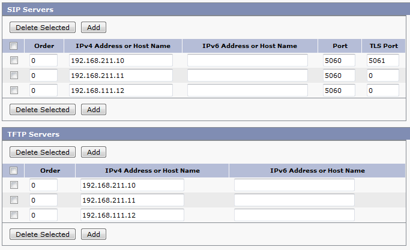
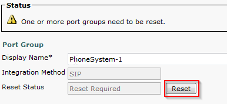

+++
title = "Configuring SIP Integration Between CUCM and Unity Connection"
date = 2017-05-09T09:53:48-04:00
author = "bryan"
draft = false
tags = ["cisco"]
+++
Below are the steps to configure SIP integration between CUCM and Unity Connection. This is now the Cisco recommended best practice and replaces the legacy CTI Route Point configuration.

# Create New SIP Trunk Security Profile

- In CUCM, navigate to **System** > **Security** > **SIP Trunk Security Profile**

- Click **Add New**

- Enter a Profile Name and Description, check **Accept Out-of-Dialog REFER**, **Accept Unsolicited Notification**, **Accept Replaces Header**. Click **Save**.

 
Create a SIP Profile

- In CUCM, navigate to **Device** > **Device Settings** > **SIP Profile**

- To right of **Standard SIP Profile** click **Copy**.

- Enter a Name and Description for the SIP Profile. I also like to enable **SIP OPTIONS Ping**, this will let you know if the SIP Trunk has been established, and for how long it has been up, on the **Find and List Trunks** page. Click **Save** when completed.

Create SIP Trunk

- In CUCM, navigate to **Device** > **Trunk**.

- Click **Add New**, select **SIP Trunk** and **SIP** from the drop down menus and click **Next**.

- Enter a **Device Name** and **Description**. Select the proper **Device Pool** for the Trunk. Check R**un On All Active Unified CM Nodes**.

- Under **Inbound Calls** select the CSS for inbound CUXN if you have one and check **Redirecting Diversion Header Delivery – Inbound**.

- Under **Outbound Calls**, check **Redirecting Diversion Header Delivery – Outbound**
- Be sure to set a **Rerouting Calling Search Space** to ensure the calls can be transferred from Unity back to CUCM.
- Under **SIP Information** enter the **Destination Address** of the Unity Connection Publisher. This can be an IP address or DNS name. Change the **SIP Trunk Security Profile** to the new profile we made earlier. Change the **SIP Profile** to the profile we made earlier. Click **Save**.

 
 
 Create Route Group

- In CUCM, navigate to **Call Routing** > **Route/Hunt** > **Route Group**. Click **Add New**.

- Enter a name for the **Route Group**, change **Distribution Algorithm** to **Top Down**. Find the newly created SIP trunk under Find Devices and click **Add to Route Group**. Click **Save**.

 
 Create Route List

- In CUCM, navigate to **Call Routing** > **Route/Hunt** > **Route List**. Click **Add New**.

- Enter a name for the **Route List** and click **Save**.

- Click **Add Route Group**. Select the previously configured Route Group from the drop down menu and click **Save**.

- Confirm that **Enable This Route List** and **Run On All Active Unified CM Nodes** are checked and that the correct Route List is displayed under **Route List Details**. Click **Save**.

 
 Create Route Pattern

- In CUCM, navigate to **Call Routin**g > **Route/Hunt** > **Route Pattern**. Click **Add New**.

- Enter the voicemail pilot number you’d like to use under **Route Pattern**. Select the name of the Route List we configured earlier under **Gateway/Route List**. Click **Save**.

Create Voice Mail Pilot

- In CUCM, navigate to **Advanced Features** > **Voice Mail** > **Voice Mail Pilot**. Click **Add New**.

- Enter the **Voice Mail Pilot** number, this should match the Route Pattern we created earlier. Enter the **Calling Search Space** and **Description**, check **Make this default…** and click **Save**.

Create Voice Mail Profile

- In CUCM, navigate to **Advanced Features** > **Voice Mail** > **Voice Mail Profile**. Click **Add New**.

- Enter a **Voice Mail Profile Name** and **Description**. Select the Voice Mail Pilot configured earlier. Check **Make this the default…** if you want this profile to be the system default. Click **Save**.

 

Configure Unity Connection

- In CUC, navigate to **Telephony Integration** and then click **Phone System**.

- Click the default phone system and make any changes you’d like such as the **Phone System** **Name**.

- At the top right of the Phone System Basics page look for **Related Links**. Select **Add Port Group** and click **Go**.

- Under **Create From**, change the **Port Group Type** to **SIP** from the drop down box. Give the Port Group a Display name. Under **Primary Server** settings enter the IP address of the CUCM server. Click **Save**.

- Under **Related Links** on the **Port Group Basics** page, select **Add Ports** and click **Go**.

- Enter the number of **Ports** and click **Save**.

- Navigate to the **Port Group Basics** by going to **Telephony Integrations** > **Port Group** > and click the newly created port group.

- Click **Edit** and select **Servers**.

- If you need to add secondary CUCM servers enter them under SIP servers. Follow the same steps to add additional TFTP servers.

- Click **Edit** > **Port Group Basics**. Click **Reset** to reset the Port Group.

# Test and Verify

This should be enough to configure basic SIP integration between CUCM and CUC. In CUCM you can navigate to Devices > Trunk and verify that the SIP trunk has been established. You can then test by dialing the voice mail pilot number and seeing if you hit Unity Connection.

