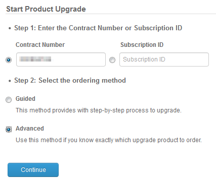
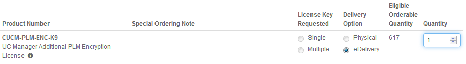

+++
title = "COBRAS Unable to import voicemail into CUC 11.5 SU3"
date = 2017-12-07T10:00:38-04:00
author = "bryan"
draft = false
tags = ["cisco"]
+++
[COBRAS](http://www.ciscounitytools.com/index.html) is an excellent utility from Cisco that makes upgrading/migrating Cisco Unity Connection installations a walk in the park, letting one jump from version to version without having to run incremental upgrades (see: [https://www.cisco.com/c/en/us/support/docs/unified-communications/unity-connection/118350-technote-cuc-00.html](https://www.cisco.com/c/en/us/support/docs/unified-communications/unity-connection/118350-technote-cuc-00.html)).

I recently ran into an issue with [COBRAS](http://www.ciscounitytools.com/Applications/General/COBRAS/COBRAS.html) failing to import voice mails into a fresh install of Unity Connection 11.5(SU3).

After opening a TAC case it was discovered that COBRAS cannot connect using IMAP on secure port 7883. To resolve the issue, a zero cost UC Encryption License needs to installed in PLM.

The UC Encryption License can be requested through Cisco’s [Product Upgrade Tool](http://upgrad.cloudapps.cisco.com/upgrad/jsp/index.jsp).




Allow up to 24 hours for the request to be completed and install the license into PLM and synchronize your servers.


After synchronizing, run the following command in the CUC CLI:
```

admin:utils cuc encryption enable
After successful execution, restart the following services on all nodes in the cluster:
 1. Connection Conversation Manager
 2. Connection IMAP Server
Do you want to proceed (yes/no)? yes

Encryption enabled successfully

```

Then restart the following services from Cisco Unity Connection Serviceability:

- Connection Conversation Manager
- Connection IMAP Server

After restarting those services COBRAS was able to successfully import voice mail.

https://www.cisco.com/c/en/us/td/docs/voice_ip_comm/connection/11x/install_upgrade/guide/b_11xcuciumg/b_11xcuciumg_chapter_0101.html