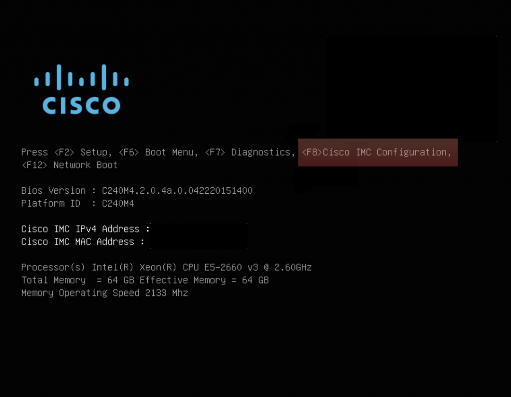
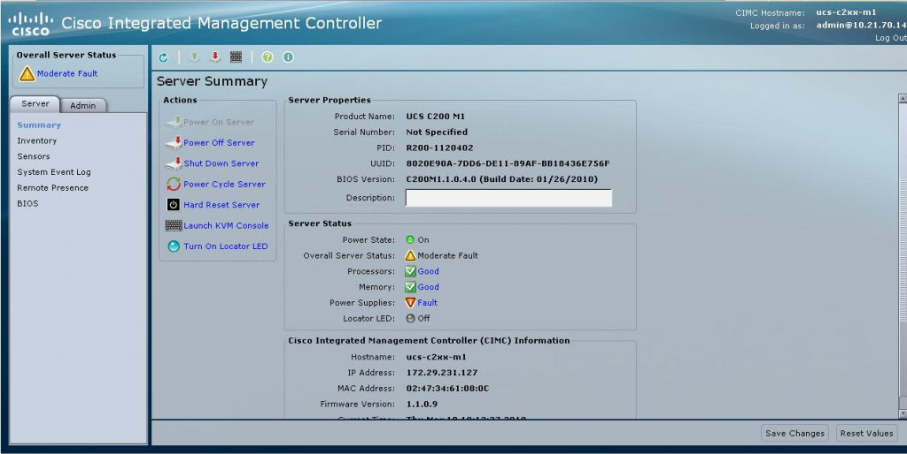

+++
title = "Configuring CIMC on a Cisco UCS C Server"
date = 2018-05-23T10:03:52-04:00
author = "bryan"
draft = false
tags = ["cisco","ucs"]
+++
Just got in a new UCS C server and was going through the process of configuring Cisco’s flavor of out of band management called CIMC or Cisco Integrated Management Controller. Similar to HP’s iLO or Dell’s iDrac, CIMC allows one to remotely control and manage their server via the web or SSH with handy tools like integrated KVM and ISO mounting.

- To configure CIMC, connect your keyboard/monitor and power up the server.
- Press F8 when the Cisco logo appears.

- When configuring CIMC for the first time it may ask for a user/password. Try admin/password or admin/Cisco1234
- Enter a new password when prompted.
- Use your arrow keys to navigate the menus. Press SPACE to select/deselect options.
- When completed press F10 to save your settings, wait 45 seconds and hit F5 to refresh and verify the settings you entered.
- Hit ESC to exit.
- You should now be able to access the CIMC web GUI by going to HTTPS://CIMC_IP/

