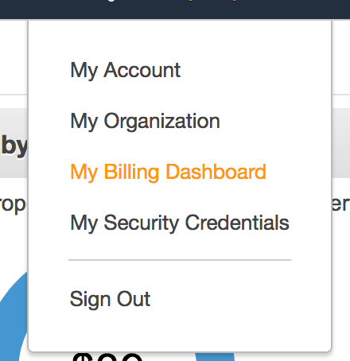
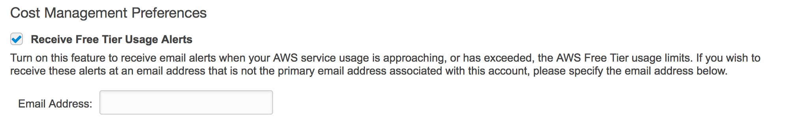
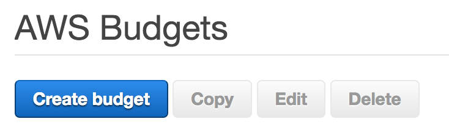
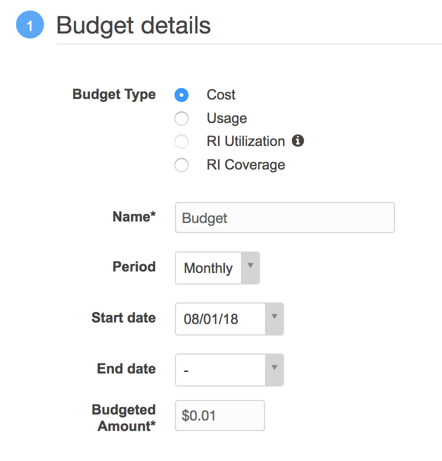
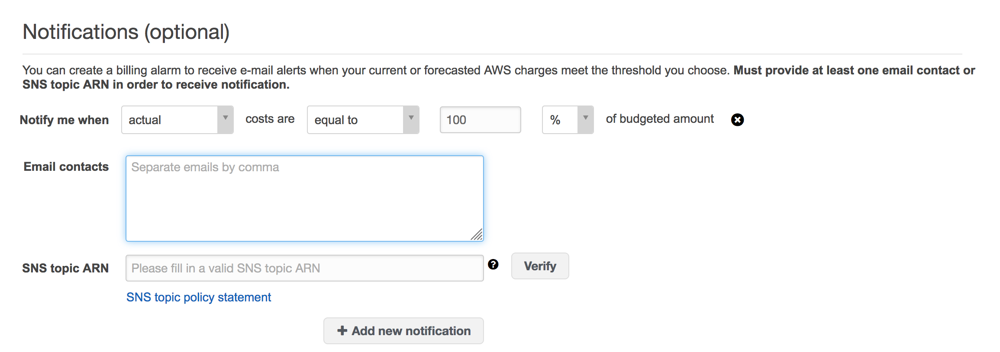
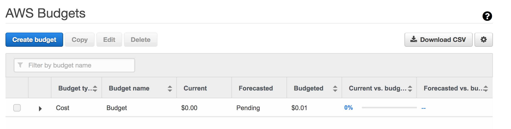

+++
title = "Set a Budget in AWS to Avoid Costly Overages"
date = 2018-08-10T10:05:49-04:00
author = "bryan"
draft = false
tags = ["aws"]
+++
If you’re like me and are experimenting with the AWS free tier it might be a good idea to configure a budget notification to avoid getting caught off guard by any overages.

Amazon has a great document on how to enable alerts located [here](https://docs.aws.amazon.com/awsaccountbilling/latest/aboutv2/tracking-free-tier-usage.html), but here’s a quick guide on how to enable alerts and budget reminders.

- First, log in to your AWS account.

- Click the drop down menu next to your name on the top right hand of the console page and select “**My Billing Dashboard**.”

- From the left hand menu select **Preferences.**

- Check “**Receive Free Tier Usage** **Alerts**” and enter your email address. Click **Save Preferences**.

- Next, click **Budgets** from the left hand menu.

- Click **Create Budget**.

- Select **Cost** and under **Budgeted Amount** select the threshold you’d like to be alerted at. For example, $0.01.

- Under **Notifications** select to be alerted when costs are equal to your 100% of your Budgeted Cost and enter your email address.

- Click **Create** and you should now have a new budget alert that will email you if you’re free tier is about to cost you some actual money.

