+++
title = "Configuring Hotspot Guest Access with Cisco ISE"
date = 2018-09-10T10:07:26-04:00
author = "bryan"
draft = false
tags = ["cisco","ise"]
+++
Been toying with the Cisco [vWLC](https://www.cisco.com/c/en/us/products/wireless/virtual-wireless-controller/index.html) and [ISE](https://www.cisco.com/c/en/us/products/security/identity-services-engine/index.html) in the home lab. Evaluation copies of ISE can be found on Cisco’s box share here: [https://cisco.app.box.com/v/ISE-Eval](https://cisco.app.box.com/v/ISE-Eval)

Here are my notes on configuring a Guest Hotspot portal. Hotspots are a simple portal where users will need to accept an Acceptable Use Policy before being granted access to the internet.

Please also see the ISE Guest Access Deployment Guide from Cisco for more details on setting up different Guest Access scenarios: [https://community.cisco.com/t5/security-documents/ise-guest-access-deployment-guide/ta-p/3640475](https://community.cisco.com/t5/security-documents/ise-guest-access-deployment-guide/ta-p/3640475)

After installing vWLC and ISE, add ISE as a AAA server on the vWLC.

- Log into the vWLC. Click the security tab at the top.  

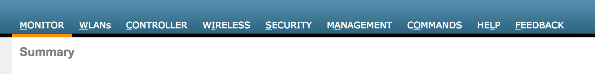

- On the left hand menu click **Authentication** under Radius/AAA.  

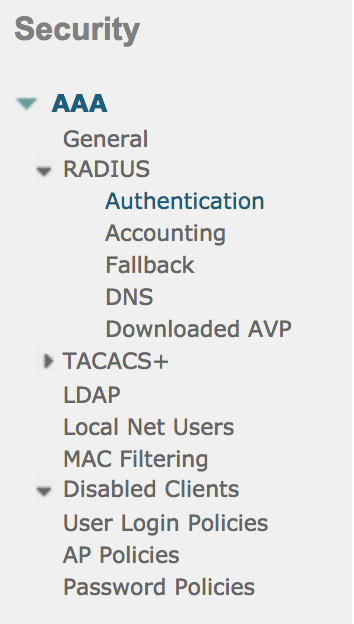

- Click the **New** button to add a new AAA server.  
    
- Enter the IP address of the ISE server, be sure port number is 1812, and that Support for COA is checked. Create a **Shared Secret** and make note of it as ISE will need to be configured with the same secret. Click Apply.  
    

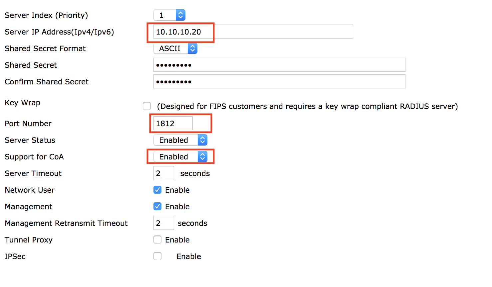

- Next click **Accounting** from the Security/AAA menu on the left. Hit **New** and enter the required information.

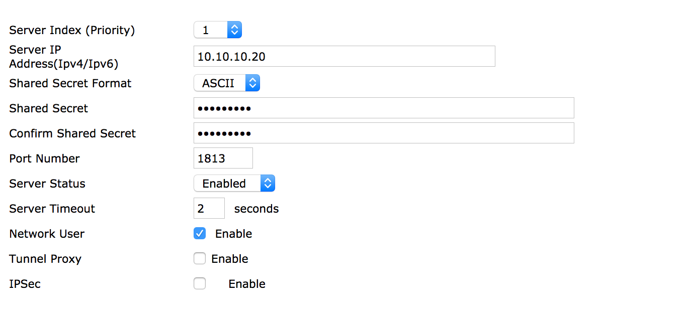

Next we will log into ISE and configure the WLC as a network device.

- Go to Work Centers, then Network Resources.

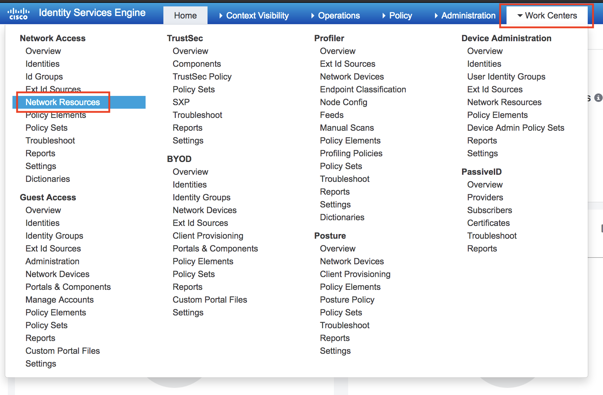

- Click **Add** and fill out the WLC information. Check **Radius Auth. Settings** and be sure to fill out the Shared Secret we filled out earlier in the WLC.

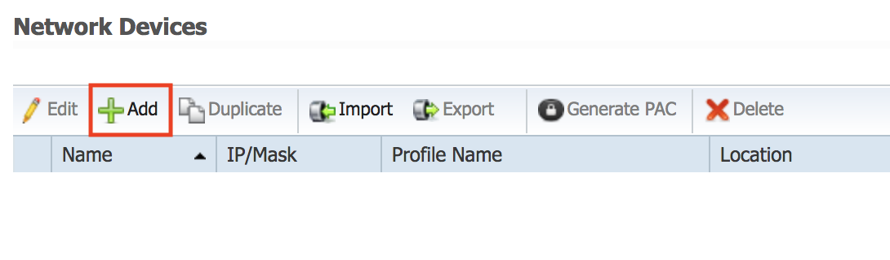

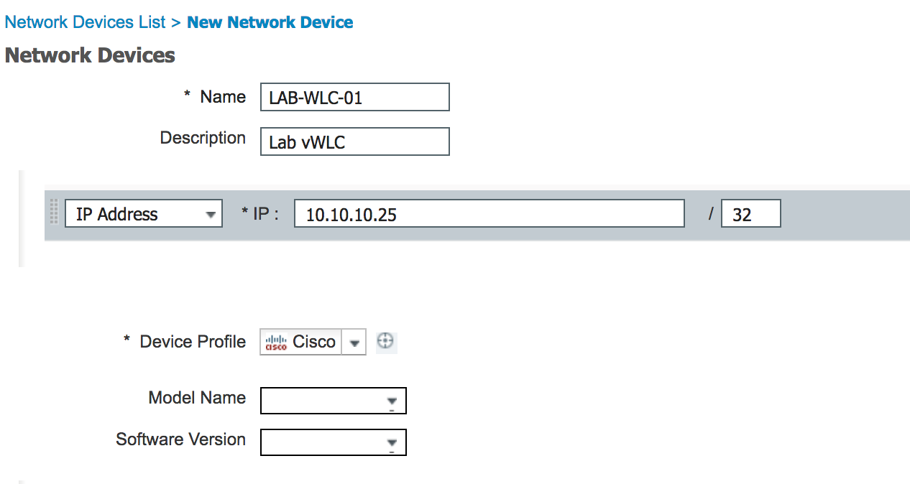

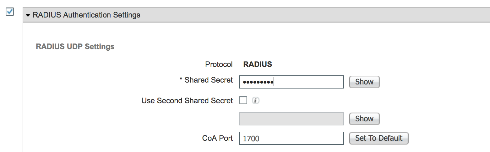

The next step is to configure our Guest WLAN/SSID.

- Log into your WLC and click the **WLANs** tab. Choose **Create New** from the drop down box and click **Go**.

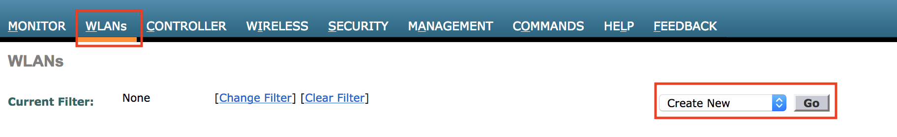

- Enter a profile name and SSID.

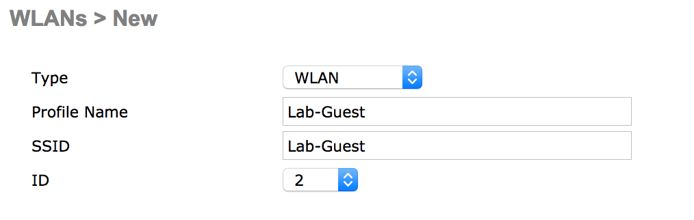

- Select Status **Enabled**, and the correct interface for your guest traffic.

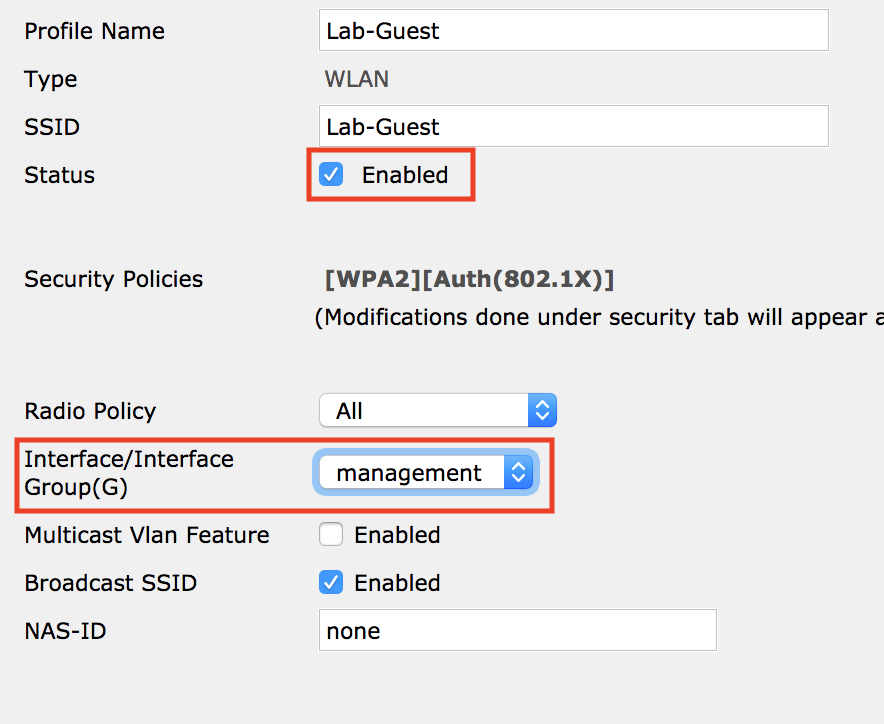

- Next click the **Security** tab.
- Change Layer 2 Security to None, and check **MAC Filtering**.

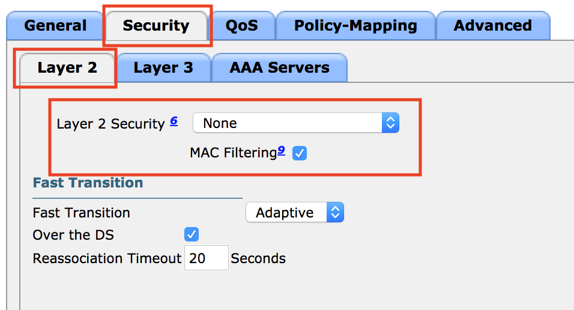

- Click **AAA Servers**, and change the Authentication and Authorization servers to the ISE server via the drop down boxes.

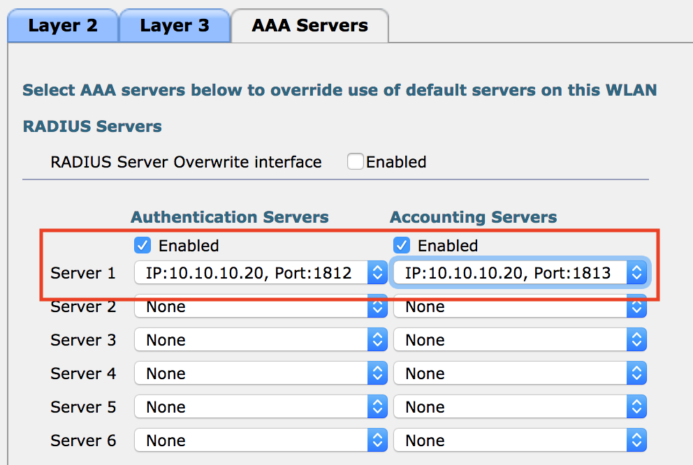

Click the **Advanced** tab.

Check **Allow AAA Override**.

Under **NAC** change the drop down to I**SE NAC**.

Uncheck **Flex Connect Local Switching** if enabled.

Check DHCP/HTTP profiling under **Radius Client Profiling**.

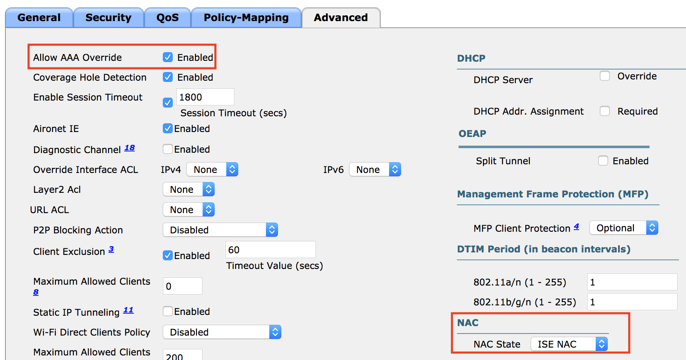

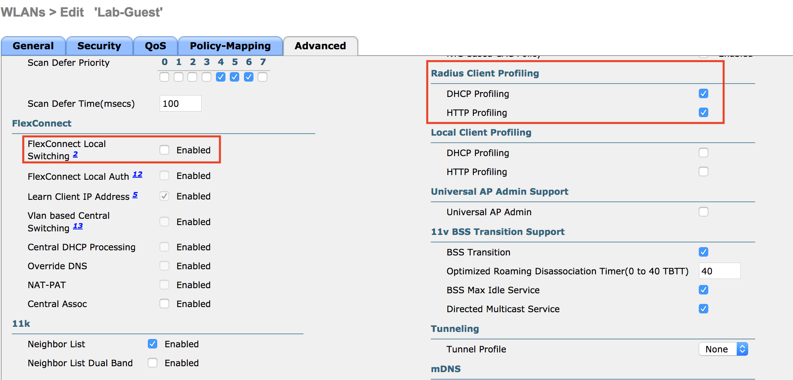

- Next we have to create a few ACLs. One for Web Auth Redirect that will allow DNS and traffic to ISE and another ACL for restricting guest access. (As this is just a lab we’re not too concerned with traffic separation but typically the best way to go about separating Guest and production traffic is through an anchor controller in the dmz, see: [https://www.cisco.com/c/en/us/td/docs/wireless/controller/8-1/Enterprise-Mobility-8-1-Design-Guide/Enterprise_Mobility_8-1_Deployment_Guide/WirelessNetwork_GuestAccessService.html](https://www.cisco.com/c/en/us/td/docs/wireless/controller/8-1/Enterprise-Mobility-8-1-Design-Guide/Enterprise_Mobility_8-1_Deployment_Guide/WirelessNetwork_GuestAccessService.html) )  
- Click Security, and find Access Control Lists on the left hand menu.

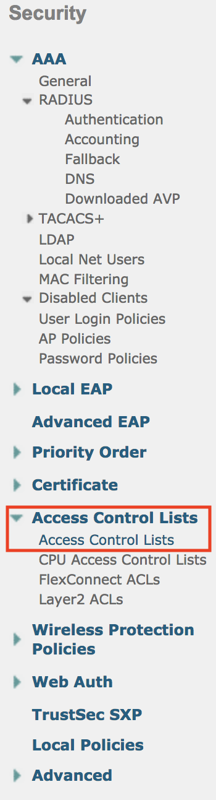

- Click New, and for the ACL name type **ACL_WEBAUTH_REDIRECT**
- Click **Apply**, then click the ACL name to start editing.  

- Click **Add New Rule**.
- Create a rule allowing destination DNS (udp/53) from any to any.
- Create a rule allowing source DNS from any to any.
- Create a rule allowing tcp from ISE to any.
- Create a rule allowing tcp from any to ISE.
- **Note**: In production you would want to limit the DNS entries to just your trusted DNS server.

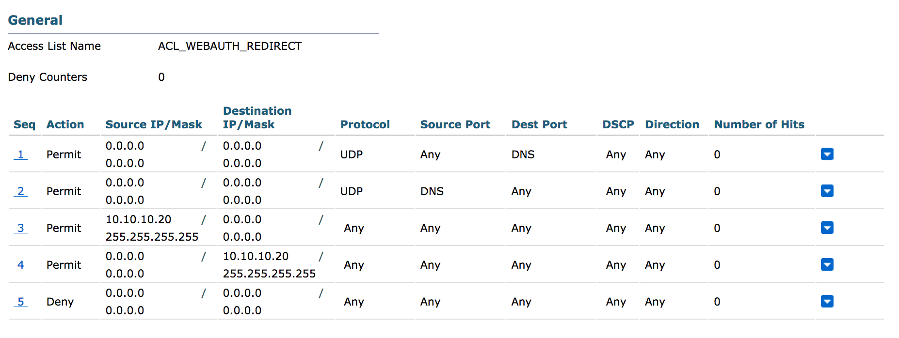

- Create a new ACL if you’d like to place any restrictions on your guest network. e.g., blocking access to any private IP space.

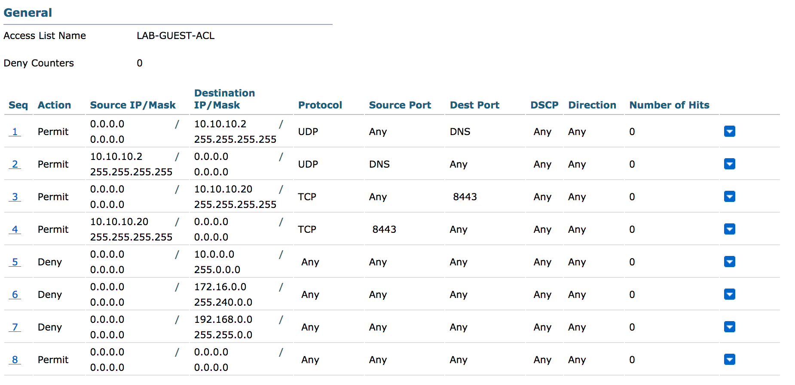

Next we’ll create ISE policies to redirect users who connect to the Guest network to a web portal. Once the AUP has been accepted they will get a new policy applied to them restricting their access to internet only via the ACL we created earlier. We’re going to be using the default hotspot portal but you can design your own portals with custom graphics. Cisco also has an ISE portal builder which has an excellent WYSIWYG editor to make custom portal building a snap. The portal builder requires a Cisco login and can be found here: [https://isepb.cisco.com/#/](https://isepb.cisco.com/#/)

- Log in to ISE. Go to **Work Centers**, **Guest Access,** **Policy Elements**.

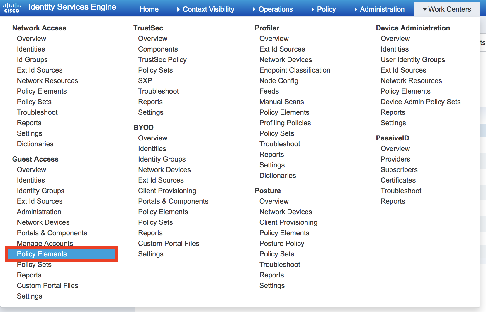

- Click **Results** and and go to **Authorization Profiles**.
- Click **Add** to create a new profile.
- Give the policy a descriptive name and description.

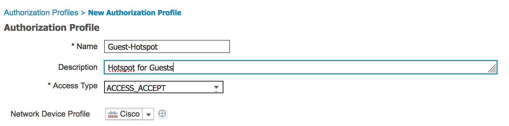

- Scroll down a bit in the **Common Tasks** and check **Web Redirection**.
- Select **Hotspot** from the drop down. Enter **ACL_WEBAUTH_REDIRECT** as the ACL and the value will be the Hotspot guest portal (if you’ve uploaded a customer portal you can select it here).
- Click **Submit**.

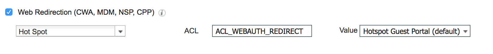

- Click **Add** again, enter a new name and description. This policy will apply the guest restriction ACL we created on the WLC.
- Scroll down into the **Common Tasks** and find **Airespace ACL**, enter the name of the Guest ACL you created earlier. Click **Submit**.  

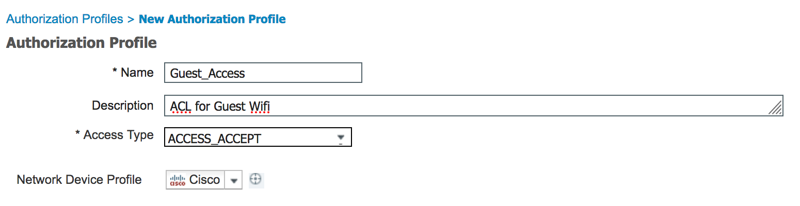

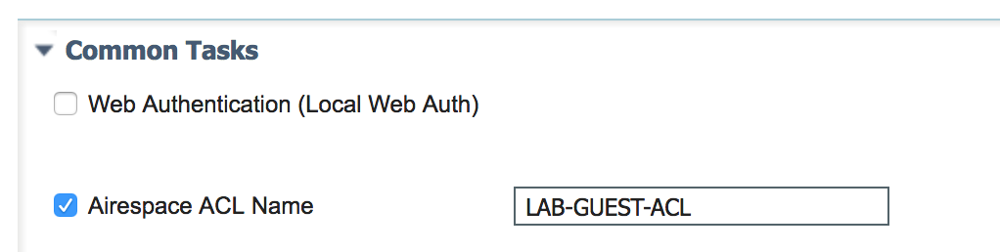

- Now, go to **Work Centers**, **Guest Access**, **Policy Sets**.

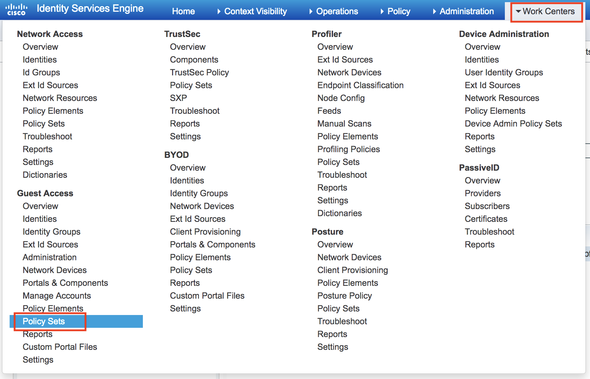

- Expand the Default policy set by clicking the arrow on the right.

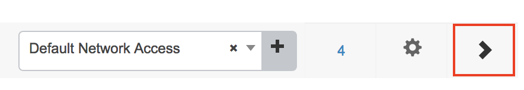

- Expand the Authentication Policy be clicking the arrow.

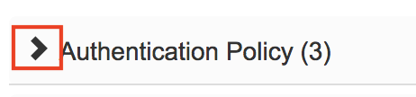

- Find **MAB** (MAC Address Bypass) and expand the options menu. Be sure the option for “**If User not found**” is set to **Continue**.

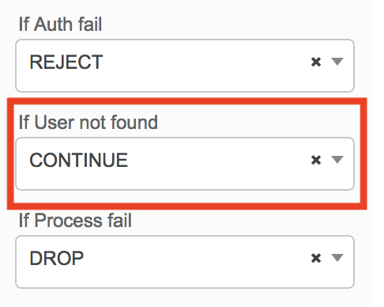

- Next we’ll create our new Authorization Polices for the Guest network. Expand **Authorization Policy** and select a space to insert the polices. Locate a rule and click the gear, select insert above or below rule to place the new policies where you’d like them.
- Enter a name for the policy. Select **Wireless_MAB** as the condition, and Guest_Hotspot as the **Profile**.

- Add a new profile above the one we just created
- This will be for applying the Guest ACL for the user once going through the portal. Conditions will be **Wireless_MAB**, **IdentityGroup = GuestEndpoints**, and **Guest_Flow**. Result will be the Guest_Access policy we created which applies the ACL we created on the WLC.  

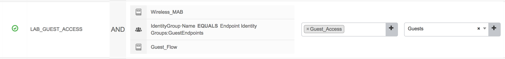

- Click **Save**.

This should be enough configuration to get the Guest Hotspot SSID up and running. Connecting to the new SSID should pop up the AUP, once accepted you should then have access to the internet.

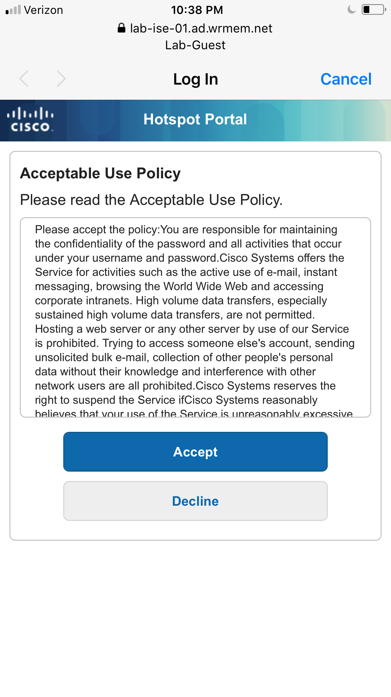