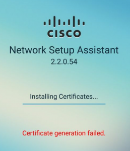
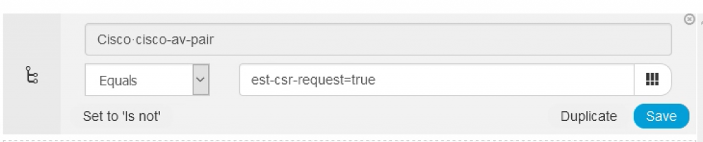

+++
title = "Cisco ISE - Fixing Certificate Generation Failed Error with Android Devices"
date = 2019-02-13T10:22:51-04:00
author = "bryan"
draft = false
tags = ["cisco","ise"]
+++
Ran into some issues recently with Android devices and the Cisco Network Setup Assistant while attempting to provision certificates as part of the BYOD work flow.

While on-boarding an Android device, the following error occurred:

TAC pointed me to this helpful YouTube video that contained the solution.

https://www.youtube.com/watch?v=z0sRiffVdpg

Starting with Android 6, EST is natively used by the device for Certificate Signing Requests. To fix the issue we need to allow the EST authentication request through ISE. This can be accomplished with a new Authorization Policy that matches the EST request and then permits access.

- To create the rule first navigate to Policy -> Policy Sets.
- Select your wireless policy.
- Expand your Authorization Policy.
- Insert a new rule.
- Give the rule a descriptive name.
- Click + under conditions.
- For Attribute we want Cisco: cisco-av-pair
- For the Attribute Value we want est-csr-request=true

Your condition should look something like this:

- Click Use.
- Under Results -> Profile, select Permit Access.
- Save your Authorization Policy.

Your new Policy should look something like this:

Try to enroll your android device again and you should now be successful in EST authentication and device provisioning.