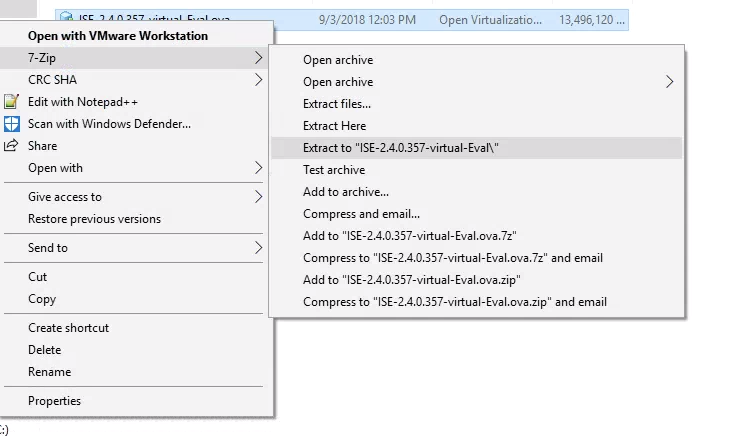

+++
title = "Cisco ISE Deployment OVF Parameter chunkSize Error"
date = 2019-04-04T10:24:01-04:00
author = "bryan"
draft = false
tags = ["cisco","ise"]
+++
Ran into a fun issue with vCenter 6.5 and a deployment of ISE. When deploying the ISE ova template we received a chunk size error: “OVF parameter chunkSize with value XXXXXXXXXX” is currently not supported for OVF package import.

Thankfully a VMware kb article walks us through how to fix the issue.

[https://kb.vmware.com/s/article/2148588?lang=en_US](https://kb.vmware.com/s/article/2148588?lang=en_US)

The first step is to unpack the ova file with a tool such as 7zip on Windows or tar on Linux/Mac.

Windows:

Linux/Mac:

tar xvf ISE-2.4.0.357-virtual-Eval.ova

Depending on the version of ISE you’re deploying there should be a number of vdmk files. On Linux/Mac we can use the cat command to combine these into one disk file. On windows the copy command will accomplish the same thing.

Windows:

copy /b ISE-2.4.0.357-virtual-Eval-disk1.vmdk.gz.000000000 + ISE-2.4.0.357-virtual-Eval-disk1.vmdk.gz.000000001 + ISE-2.4.0.357-virtual-Eval-disk1.vmdk.gz.000000002 + ISE-2.4.0.357-virtual-Eval-disk1.vmdk.gz.000000003 + ISE-2.4.0.357-virtual-Eval-disk1.vmdk.gz.000000004 + ISE-2.4.0.357-virtual-Eval-disk1.vmdk.gz.000000005 + ISE-2.4.0.357-virtual-Eval-disk1.vmdk.gz.000000006 ISE-2.4.0.357-virtual-Eval-disk1.vmdk

Linux/Mac:

cat ISE-2.4.0.357-virtual-Eval-disk1.vmdk.* > ISE-2.4.0.357-virtual-Eval-disk1.vmdk

Next we just have to edit the .ovf file to point to the new disk1 we created. Open the ovf in a text editor and find the chunk size attribute.

Original value:

< File ovf:href="ISE-2.4.0.357-virtual-Eval-disk1.vmdk" id="file1" size="13819990977" / >

chunkSize removed:

< File chunkSize="2147483648" compression="gzip" href="ISE-2.4.0.357-virtual-Eval-disk1.vmdk.gz" id="file1" size="13819990977" / >

  

Deploy your edited ovf and you should now be able to proceed with the ISE installation error free.