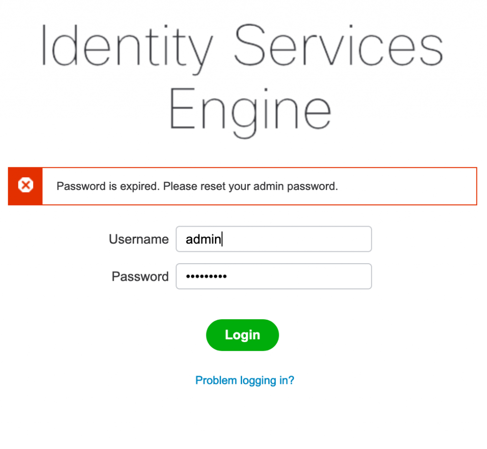
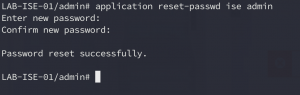
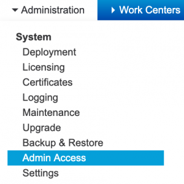
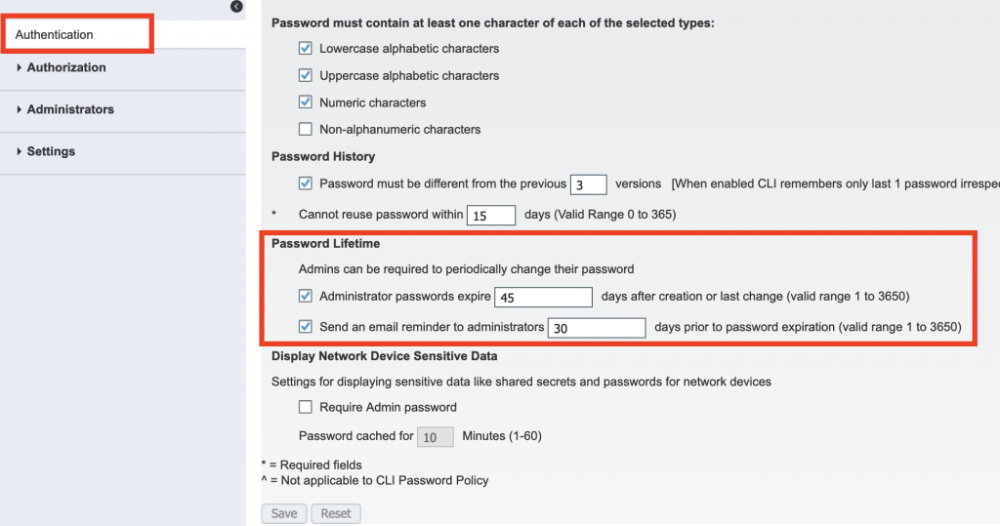

+++
title = "Cisco ISE Admin Password Expired"
date = 2019-05-07T10:24:55-04:00
author = "bryan"
draft = false
tags = ["cisco","ise"]
+++
So you’ve installed ISE, configured your policies, got everything up and running. Life is peachy…until you attempt to log in and receive the following error:

One little gotcha. Out of the box, the GUI admin account is set to expire after 45 days. So just when you thought everything was up and running smoothly you hit this little stumbling block.

Thankfully the fix is fairly straight forward, but if you’ve just received the error above you’ll need to do a little CLI intervention.

SSH into your ISE server with your CLI username/password. At the command prompt enter **“application reset-passwd ise admin”** and follow the on-screen prompts:

Now to avoid the headache of resetting your password from the CLI every 45 days you can edit the admin password policy to allow for a more lenient password history or disable expiration completely.

To do so, log into ISE then go to **Administration -> Admin Access**.

Under the Authentication section look for **Password Lifetime**. Here we can edit/enable/disable password expiration settings or even configure email alerts when the password is about to expire.

