+++
title = "Cisco ISE Configuring TACACS+ Device Management"
date = 2019-06-11T10:26:11-04:00
author = "bryan"
draft = false
tags = ["cisco","ise"]
+++
As of version 2.0, Cisco ISE now supports TACACS+ for user authentication, command authorization, and accounting (the three A’s in AAA) for network device management.

I won’t get into the age old debate of TACAS+ vs RADIUS but for many industries, especially those that may be under stricter compliance, governance and regulation; TACACS+ presents certain advantages thanks to per-command authorization and detailed accounting/logging.

This post will go over the steps to implement TACACS+ based AAA for Cisco devices based on active directory group membership.

This is a fresh install of the ISE 2.4 evaluation vm, installed in my test lab. After the initial setup, log in to ISE and go to **Administration -> Deployment**.

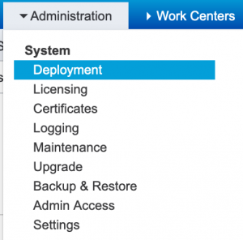

Find your ISE server and click Edit. Scroll down to **Policy Service** and check “**Enable Device Admin Service**.” Click Save.

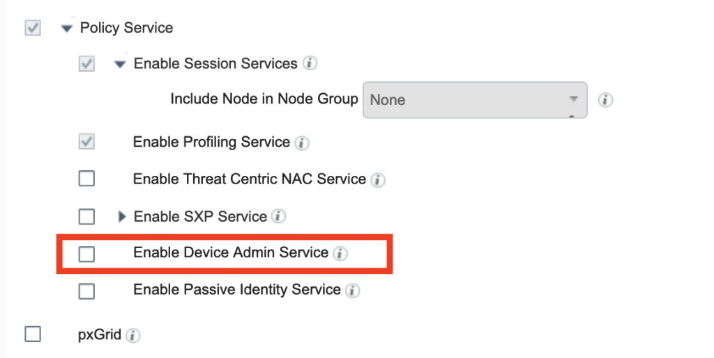
Next we will need to bind the ISE server to the Active Directory domain and grab our AD groups. For this example I have created two AD groups, one called Network Admins and the other Help Desk. We will create two separate authorization profiles, one that allows Network Admins full access to the device and a second for help desk users that will limit them to only show commands.

- Go to **Administration-> External Identity Sources -> Active Directory**
- Click **Add**
- Enter a name for the Join Point as well as the Active Directory domain name. Click **Submit**.

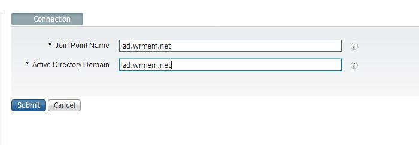

- When prompted to join the node to the domain press **Yes**.

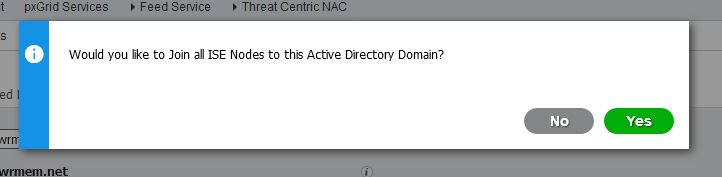

- Enter your domain credentials that have permission to join a computer to the domain and specify the OU to place the object if you’d like. Click **Ok**.

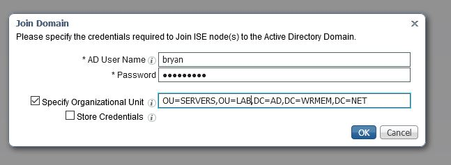

- Wait a moment after hitting ok and you should see a status messaging indicating if the join was successful or not.

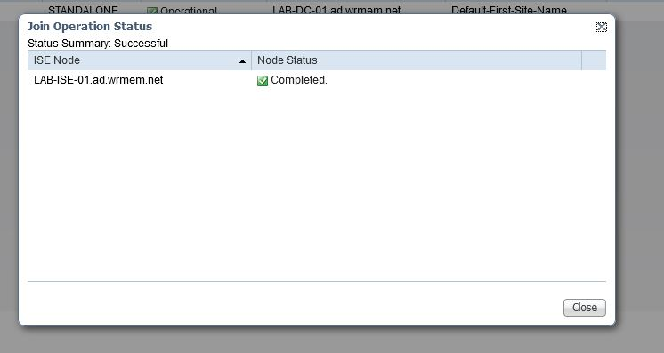

- After clicking close click the **Groups** tab.

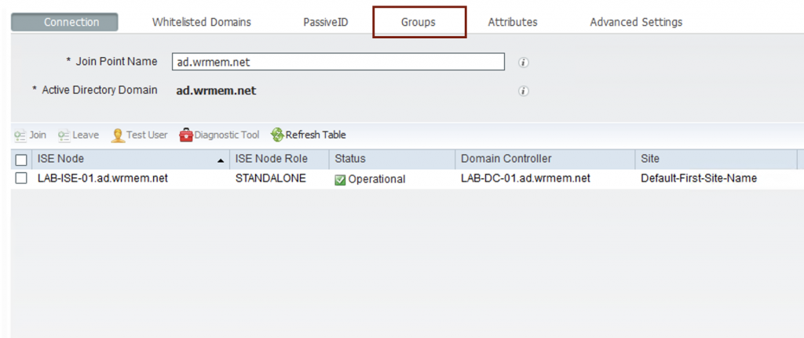

- Click Add and “**Select Groups From Directory**“
- A **Select Directory Groups** window should appear. To list all AD groups you can leave the wild card in the name filter or enter a more specific name if you know the group you’d like to add.
- Click **Retrieve Groups** and a list of AD groups should populate.
- For the purpose of this demo I will select **Network Admins** and **Help Desk** and then click Ok.

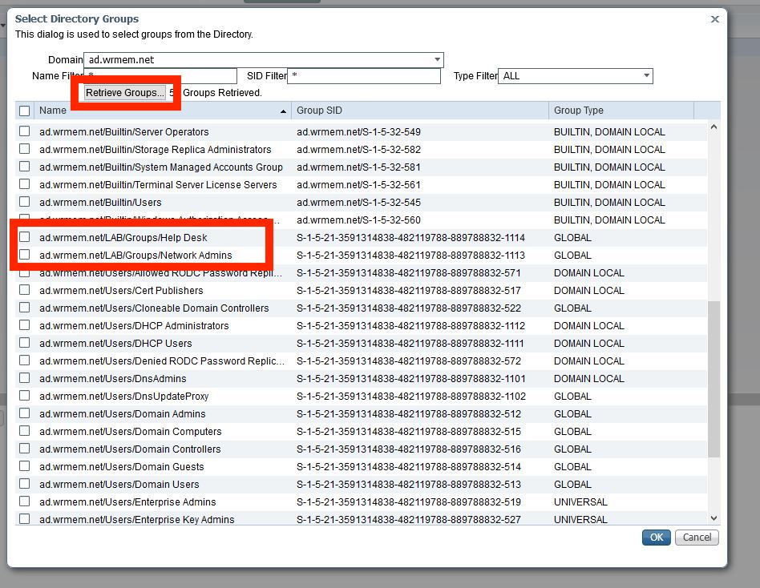

Now we’ll want to create an **Identity Source Sequence** that will contain our AD groups, and if needed any local accounts on ISE (in the event that AD can’t be contacted it’s not a bad idea to have a local ISE account to log into your equipment).

- Go to **Administration** -> **Identity Management** -> **Identity Source Sequences**
- Click **Add**
- Give a name, optional description, add your ad join point and internal users, then select the option to **Treat as if the user was not found and proceed to the next store in the sequence**
- Click **Save**

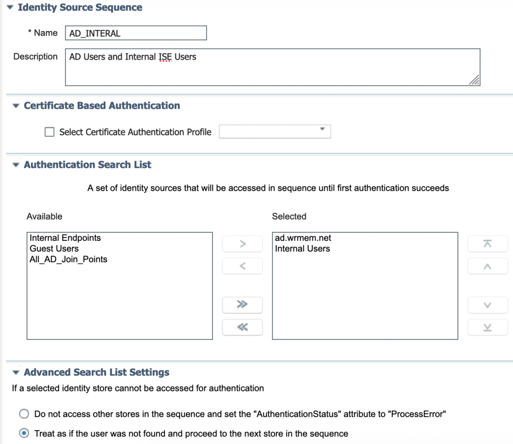

- Next we’ll want to add our network device. In this demo I’m running a 3750 switch.
- First I like to create a network device group for the type of device I’m adding. In this example it’s a switch. You can create as many device groups/locations/etc. to get as granular as you’d like for your devices and rule sets.
- To add a network device group go to **Work Centers -> Device Administration -> Network Resources -> Network Device Groups**
- Click **Add**.
- Enter a descriptive name and the parent group.
- Click **Save**.

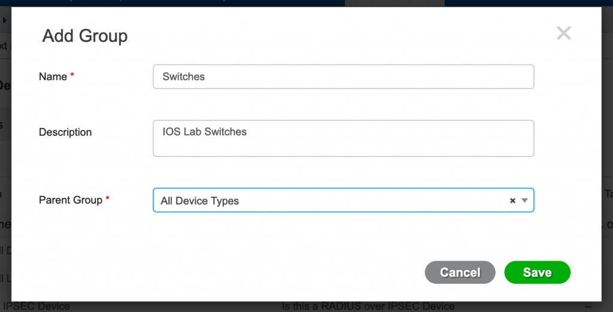

- To add a network device go to **Work Centers -> Device Administration -> Network Resources -> Network Devices**
- Click **Add**

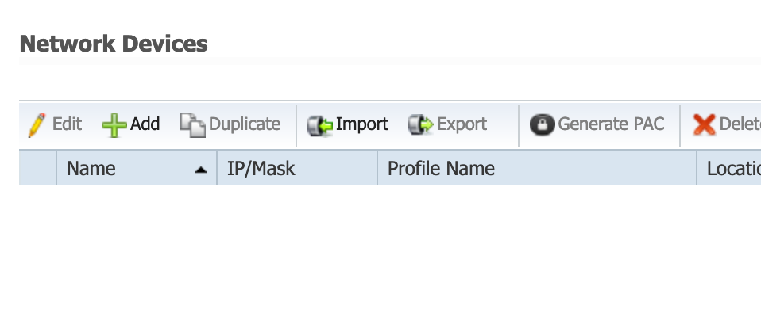

- Enter a name, optional description, ip address, and select the device type from the drop down.

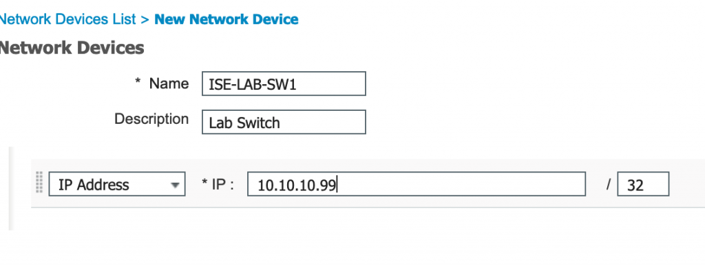

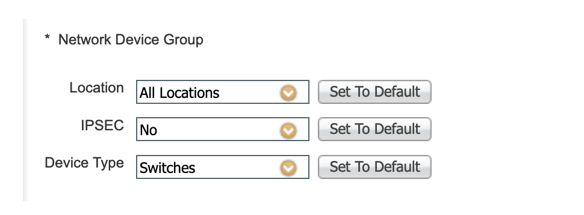
- Scroll down and place a check mark next to **TACACS Authentication Settings**.
- Enter a shared secret.
- Click **Submit**.

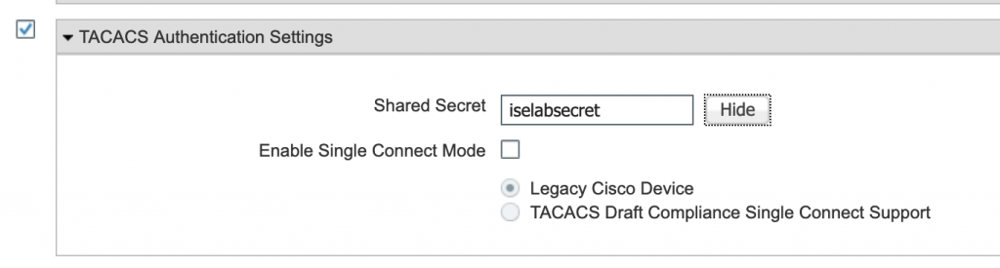

- Next up we need to configure our command sets and TACACS profiles. These will be the allowable/available commands for users of the different AD groups.
- Go to **Work Centers -> Device Administration -> Policy Elements -> Results -> TACACS Command Sets**
- Click **Add**.
- Enter a name and check the box for “**Permit any command that is not listed below**“
- Click **Submit**.

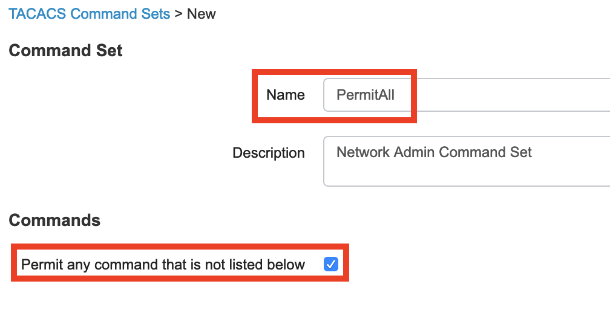

- You should be back at the TACACS command set page.
- Click **Add** again.
- This next command set will be for help desk users.
- Enter a name and under commands click **Add** to add the commands you wish to grant your help desk users (e.g. show, ping, etc.)
- Click **Submit**.

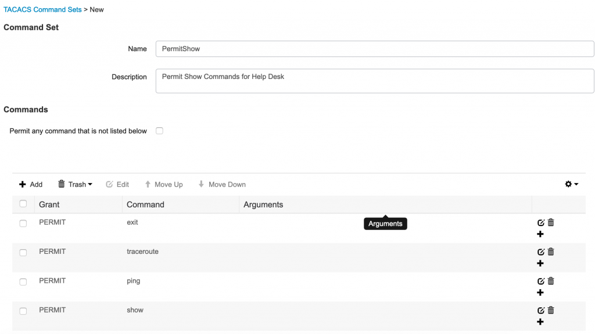

- Next up are the TACACS profiles. These determine privilege levels, think level 1-15 on IOS switches.
- Go to **Work Centers -> Device Administration -> Policy Elements -> Results -> TACACS Profiles**
- Click **Add**.
- Enter a name for the Profile and set the default privilege level to 15. We don’t need to worry about Help Desk users being able to run actual level 15 commands as the list of available commands have been set in TACACS Command set.
- Click **Submit**.

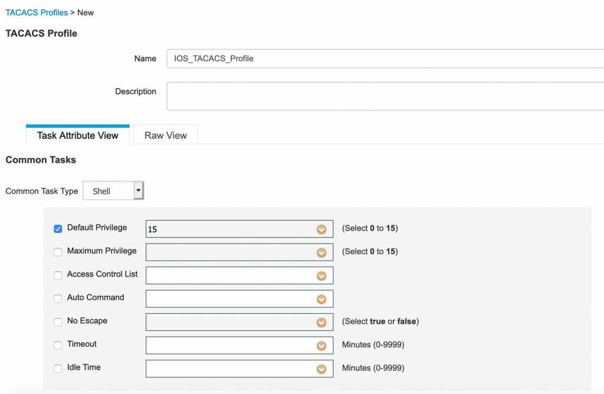

- Still with me? Almost there. The next step is to configure the actual ISE TACACS policies, combing all the previous efforts into one comprehensive policy.
- Go to **Work Centers -> Device Administration -> Device Admin Policy Sets**
- Click the Plus sign to add a new Policy Set

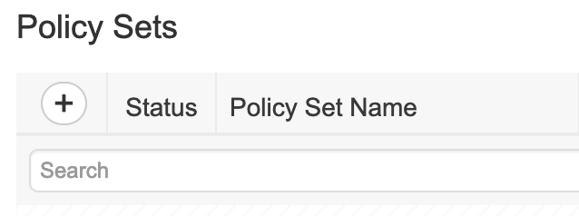

- Enter a name for the policy.
- Click the Plus sign under Conditions. In the condition editor select Device Type Equals and then select the device type you created earlier. In this case “Switches.”
- Click **Use**.

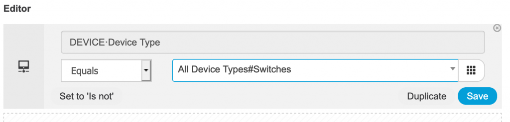

- Under **Allowed Protocols** select **Default Device Admin**
- Click **Save**.
- Next expand **Authentication Policy** by clicking the arrow on the left.
- To keep things simple you can change the the default authentication rule to use the new Identity Source Sequence we made earlier. You can also get granular and add a new Authentication policy that targets TACACS logons. For this demo we’ll just change the default rule.
- Click **Save**.

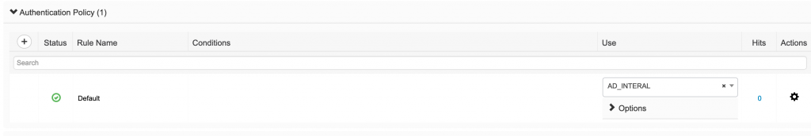
- Next, expand the **Authorization Policy** by click the left arrow.
- We’ll add our Network Admins policy first.
- Click the plus sign to add a new policy.
- Give it a rule name such as **Network Admins**.
- Click the plus sign under **conditions**.
- In the **Conditions Studio** click attributes over on the right hand side.
- Click the Identity Group icon and you should see your ad join point, click that.

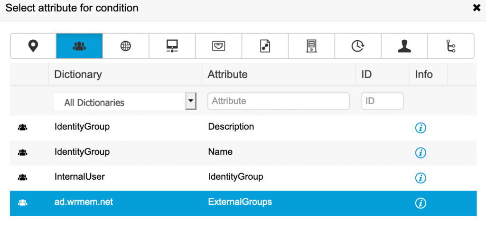

- Click where it says **Choose from list or type** and select **Network Admins** from the drop down.
- The condition should look something like this:

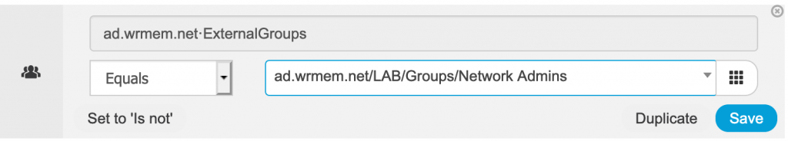
- Click **Use** to go back to the Authorization policy editor.
- Under command sets select **PermitAll**
- Under shell profiles select the TACACS profile we created earlier.
- The policy should look like this:

- Repeat the same steps to build your Help Desk policy, selecting your help desk AD group and changing the command set to PermitShow and settingthe TACACS profile.

- Click **Save**.

In the home stretch now, next we need to configure our network devices, test and verify.

My lab switch is an old 3750 running IOS 12. The following commands work with IOS 12, please note that IOS 15 has deprecated some commands. For example in IOS 12 you would use **tacacs-server host X.X.X.X** to define your TACACS server where as in IOS 15 the command is:

tacacs server TACACS_ISE  
address ipv4 X.X.X.X

- First enable new-model AAA and define your TACACS server.

IOS12

`aaa new-model`  
`!`  
`tacacs-server host 10.10.10.20`  
`tacacs-server directed-request`  
`tacacs-server key iselabsecret`  
`!`  
`aaa group server tacacs+ TACACS-ISE`  
`server 10.10.10.20`

IOS15

`aaa new-model`  
`!`  
`tacacs server ISE`  
`address ipv4 10.10.10.20`  
`key iselabsecret`  
`aaa group server tacacs+ TACACS-ISE`  
`server name ISE`

- Define a new login list named ISE-VTY using the group TACACS-ISE followed by local login if failed, the -case following local means that username/passwords are case sensitive.

`aaa authentication login ISE-VTY group TACACS-ISE local-case`

- Define enable access using the TACACS-ISE group followed by the local enable password.

`aaa authentication enable default group TACACS-ISE enable`

- Create a new login authentication list called CONSOLE that uses case sensitive local users

`aaa authentication login CONSOLE local-case`

- Create an authorization list that allows exec mode for ISE-VTY users if authenticated.

`aaa authorization exec ISE-VTY group TACACS-ISE local if-authenticated`

- To allow IOS to authorize configuration commands we use the config-commands command.

`aaa authorization config-commands`

- Allow for command authorization of level 1 and level 15 commands for ISE-VTY users.

`aaa authorization commands 1 ISE-VTY group TACACS-ISE local if-authenticated` 
`aaa authorization commands 15 ISE-VTY group TACACS-ISE local if-authenticated`

- Enable exec, system, and command accounting.

`aaa accounting exec default start-stop group TACACS-ISE`
`aaa accounting commands 1 default start-stop group TACACS-ISE`
`aaa accounting commands 15 default start-stop group TACACS-ISE`
`aaa accounting system default start-stop group TACACS-ISE`

- Set the source interface for TACACS communication.

`ip tacacs source-interface Loopback 0`

Before we apply these new aaa lists to our vty lines it might be best to test that the switch can properly communicate and authenticate with ISE. You can do this with the test aaa comand.

`ISE-LAB-SW1#test aaa group TACACS-ISE bryan XXXXXX legacy` 
`Attempting authentication test to server-group TACACS-ISE using tacacs+`
`User was successfully authenticated.`

Now that we know authentication works we can finally, set our console and vty lines to use the new authentication and authorization sets.

`line con 0`
 `login authentication CONSOLE`
`line vty 0 4`
 `login authentication ISE-VTY`
 `authorization exec ISE-VTY`
 `authorization commands 15 ISE-VTY`
 `authorization commands 1 ISE-VTY`
`line vty 5 15`
 `login authentication ISE-VTY`
 `authorization exec ISE-VTY`
 `authorization commands 15 ISE-VTY`
 `authorization commands 1 ISE-VTY`

Now we can attempt to connect to the switch with out AD credentials and test and verify our setup.

- In ISE you can navigate to Operations -> TACACS Live Logs to get a quick view of connection status, policies applied, etc.

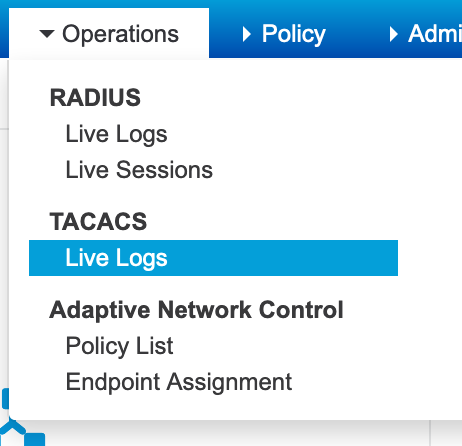

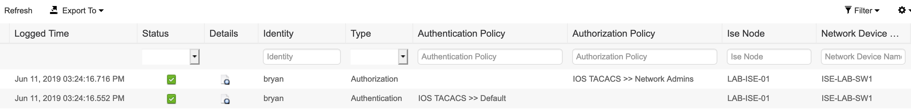

If you were successful in logging in to the switch you should see a green check mark as well as the authentication and authorization polices that have been applied. Clicking the little icon under the detail columns will give you a detailed report showing each step of authentication and authorization, in painful detail.

We can now test our help desk use to see if they’re getting the proper restricted command set we defined earlier.

`ISE-LAB-SW1#ping 1.1.1.1`

`Type escape sequence to abort.`
`Sending 5, 100-byte ICMP Echos to 1.1.1.1, timeout is 2 seconds:`
`!!!!!`
`Success rate is 100 percent (5/5), round-trip min/avg/max = 33/35/42 ms`
`ISE-LAB-SW1#sh run int fa1/0/1`
`Building configuration...`

`Current configuration : 35 bytes`
`!`
`interface FastEthernet1/0/1`
`end`

`ISE-LAB-SW1#conf t`
`Command authorization failed.`

`ISE-LAB-SW1#`

And here’s our failure report from when we tried to enter configure terminal.

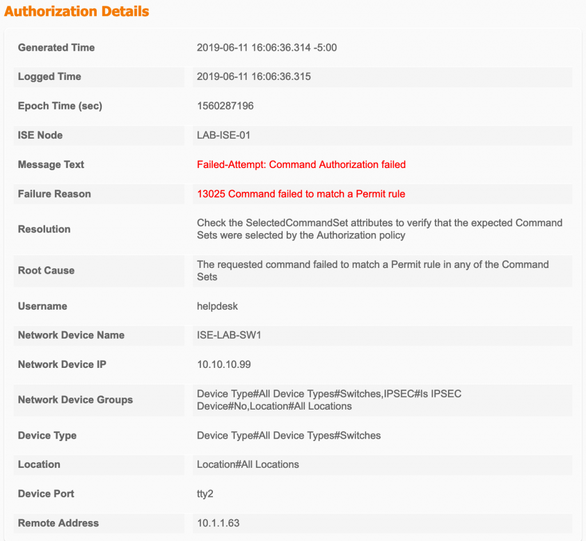