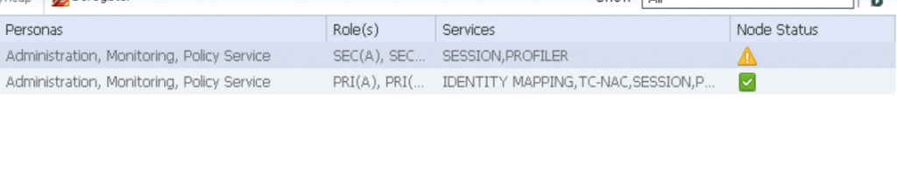
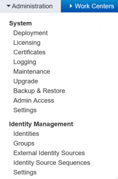
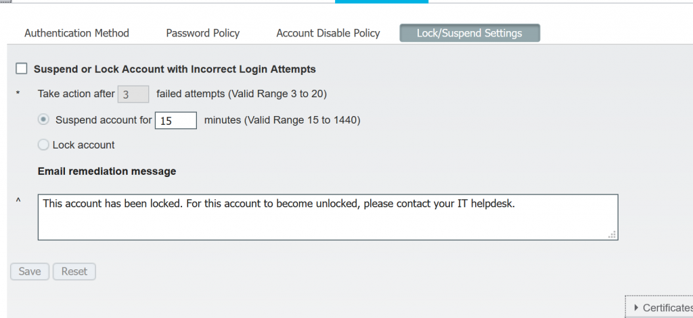
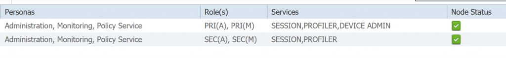

+++
title = "Cisco ISE Synchronization Failed when adding a Secondary Node"
date = 2019-10-15T10:35:06-04:00
author = "bryan"
draft = false
tags = ["cisco","ise"]
+++
Ran into an interesting issue the other day setting up a two node ISE deployment. I figured I’d put it up on the blog in case anyone else is pulling out their hair.

After adding a secondary node, the deployment nodes status page lists an error saying “synchronization failed.”

When I consoled into the ISE node I saw multiple failed logins:

Failed to log in 51 time(s)  
Last failed login on Tue Oct 15 11:38:37 2019 from 10.102.10.168  
ISE3615-1/admin#

When the second node was setup, the admin account password originally differed from the existing node. Even after changing passwords to match the failed logins continued.

To work around the issue I disabled admin account lockouts on the new node, and attempted to register again. Afterwards the node registered and everything sync’ed properly.

To disable account lockouts, go to Administration -> System -> Admin Access -> Lock/Suspend Settings and uncheck “Suspend or Lock Account with Incorrect Login Attempts”

  

