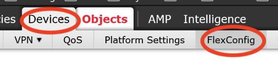
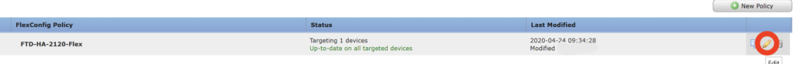
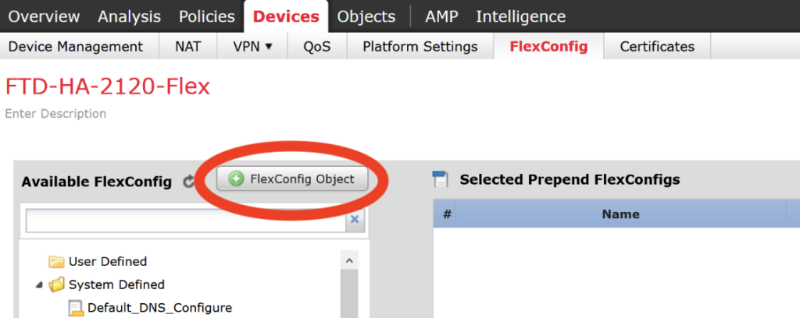
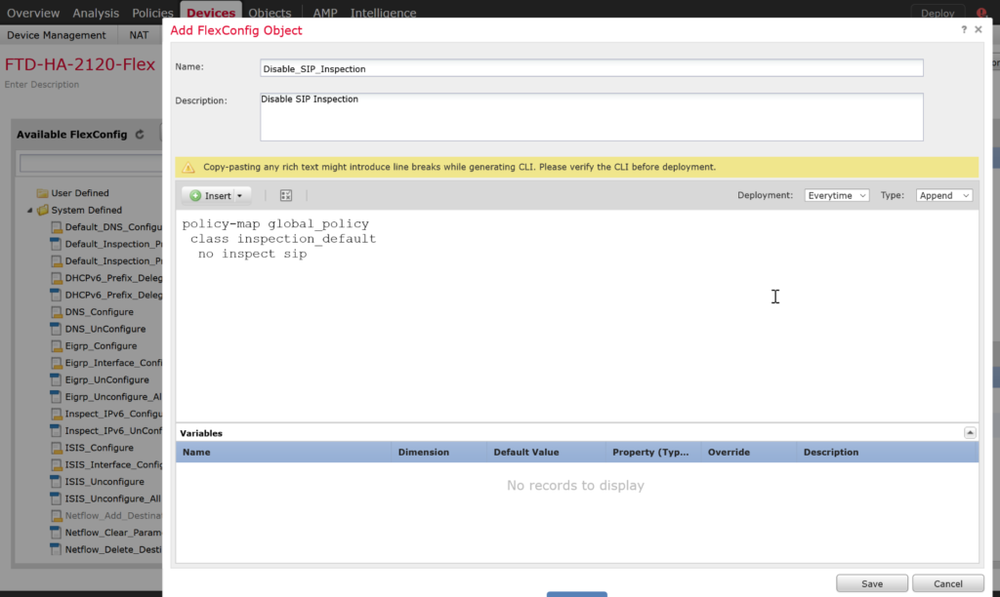
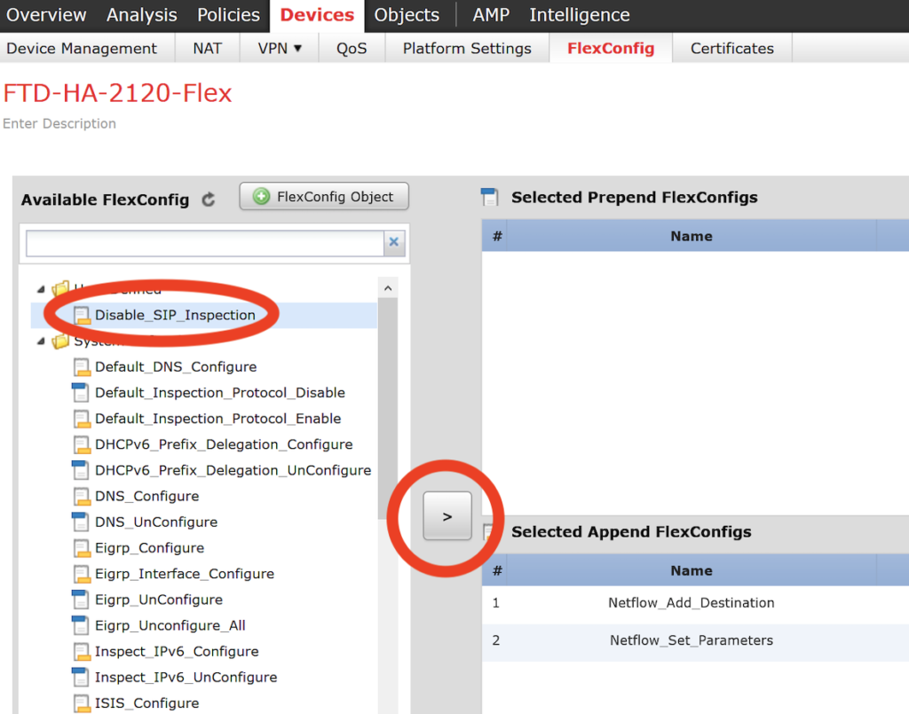
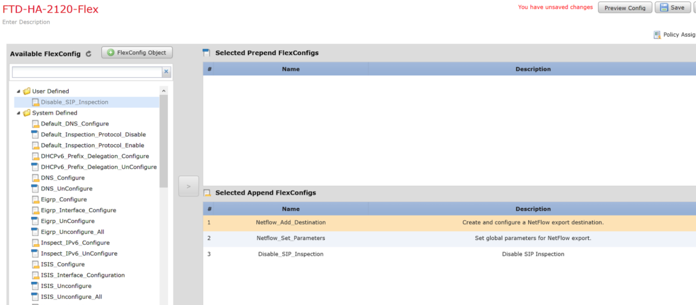

+++
title = "Disable SIP Inspection on Firepower through FlexConfig"
date = 2020-05-08T10:38:00-04:00
author = "bryan"
draft = false
tags = ["cisco","firepower"]
+++

Occasionally you may come across issues with SIP inspection on an ASA or Firepower, leading to problems with SIP/RTP voip audio. As a troubleshooting step, it’s often helpful to disable SIP inspection for testing.

Please read this note from Cisco on disabling SIP inspection to verify you everything in order before doing so:

_You would typically disable SIP only if the inspection is causing problems in the network. However, if you disable SIP, you must ensure that your access control policies allow the SIP traffic (UDP/TCP 5060) and any dynamically allocated ports, and that you do not need NAT support for SIP connections. Adjust the access control and NAT policies accordingly through the standard pages, not through FlexConfig._

For Firepower devices managed by an FMC, here are some quick instructions to push out a FlexConfig policy to disable SIP inspection.

In FMC, navigate to **Devices** > **FlexConfig**

Click the Pencil icon to edit your FlexConfig device policy. If you don’t have a policy yet click New Policy to create one.

In the FlexConfig policy click the New FlexConfig Object.

Give a name a name and description for the new new object and in the text field copy the commands below (note the indentations). Click Save.

`policy-map global_policy`  
 `class inspection_default`  
  `no inspect sip`

Under available FlexConfig find the new object we created, highlight it, and click the left arrow to add it to the policy.

With the new object added to the policy, save the policy and deploy to your FirePower.

SSH to the Firepower and run the following command to verify that SIP is no longer in the inspection list:

`show run policy-map | beg global_policy`

`policy-map global_policy`
 `class inspection_default`
  `inspect dns preset_dns_map`
  `inspect ftp`
  `inspect h323 h225`
  `inspect h323 ras`
  `inspect rsh`
  `inspect rtsp`
  `inspect sqlnet`
  `inspect skinny`
  `inspect sunrpc`
  `inspect xdmcp`
  `inspect netbios`
  `inspect tftp`
  `inspect icmp`
  `inspect icmp error`