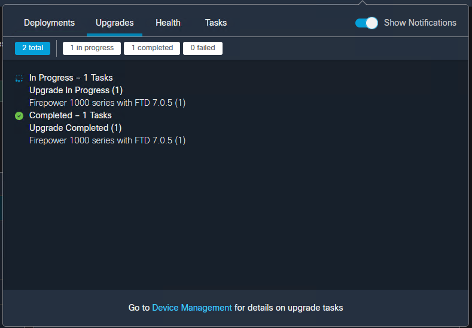

+++
title = "Monitoring a Firepower Upgrade with Tail"
date = 2023-03-16T10:40:51-04:00
author = "bryan"
draft = false
tags = ["cisco","firepower"]
+++

While Cisco’s Secure Firewall Management Center is a great tool there’s still some missing functionality here and there. Upgrades, for one, is a great example. How do you know when an upgrade has failed? Why did it fail? Where did it fail?

Sure the Task pane shows us the progress but truthfully that’s about it.

So for today, a quick update on how I monitor the progress of a Firepower Threat Defense upgrade through the command line.

- First, SSH into the device.
- Issue the “expert” command.
- Enter into super user mode with “sudo su”
- Change directory to “/ngfw/var/log/sf/upgrade version number”
- Run “tail -f status.log”
- Roll that beautiful bean footage.

`Last login: Tue Jan 24 18:18:07 UTC 2023 from 192.168.100.30 on pts/0`
`Successful login attempts for user 'admin' : 1`

`Copyright 2004-2019, Cisco and/or its affiliates. All rights reserved.`
`Cisco is a registered trademark of Cisco Systems, Inc.`
`All other trademarks are property of their respective owners.`

`Cisco Fire Linux OS v6.4.0 (build 2)`
`Cisco Firepower 1120 Threat Defense v6.4.0.9 (build 62)`

`> expert`
`**************************************************************`
`NOTICE - Shell access will be deprecated in future releases`
         `and will be replaced with a separate expert mode CLI.`
`**************************************************************`
`admin@lab-ftd-01:~$ sudo su`

`We trust you have received the usual lecture from the local System`
`Administrator. It usually boils down to these three things:`

    #1) Respect the privacy of others.
    #2) Think before you type.
    #3) With great power comes great responsibility.

`Password:`

`root@lab-ftd-01:/# cd /ngfw/var/log/sf`
`root@lab-ftd-01:/ngfw/var/log/sf# ls`

`Cisco_FTD_SSP_FP1K_Upgrade-7.0.5` 

`root@lab-ftd-01:/ngfw/var/log/sf# cd Cisco_FTD_SSP_FP1K_Upgrade-7.0.5`
`root@lab-ftd-01:/ngfw/var/log/sf/Cisco_FTD_SSP_FP1K_Upgrade-7.0.5# tail -f status.log`
`ui: Upgrade in progress: ( 0% done.26 mins to reboot). Checking device readiness... (000_start/000_0_start_upgrade_status_api_stack.sh)`
`ui: Upgrade in progress: ( 0% done.26 mins to reboot). Checking device readiness... (000_start/000_check_platform_support.sh)`
`ui: Upgrade in progress: ( 0% done.26 mins to reboot). Checking device readiness... (000_start/000_check_update.sh)`
`ui: Upgrade in progress: ( 0% done.26 mins to reboot). Checking device readiness... (000_start/099_check_legacy_amp_port.pl)`
`ui: Upgrade in progress: ( 0% done.26 mins to reboot). Checking device readiness... (000_start/100_start_messages.sh)`
`ui: Upgrade in progress: ( 0% done.26 mins to reboot). Checking device readiness... (000_start/101_run_pruning.pl)`
`ui: Upgrade in progress: ( 0% done.26 mins to reboot). Checking device readiness... (000_start/105_check_model_number.sh)`
`ui: Upgrade in progress: ( 0% done.26 mins to reboot). Checking device readiness... (000_start/107_version_check.sh)`
`ui: Upgrade in progress: ( 0% done.26 mins to reboot). Checking device readiness... (000_start/110_DB_integrity_check.sh)`
`ui: Upgrade in progress: ( 0% done.26 mins to reboot). Checking device readiness... (000_start/113_EO_integrity_check.pl)`
`ui: Upgrade in progress: ( 0% done.26 mins to reboot). Checking device readiness... (000_start/200_clean_csp_files.sh)`
`ui: Upgrade in progress: ( 0% done.26 mins to reboot). Checking device readiness... (000_start/250_check_system_files.sh)`
`ui: Upgrade in progress: ( 4% done.25 mins to reboot). Checking device readiness... (000_start/320_remove_backups.sh)`
`ui: Upgrade in progress: ( 4% done.25 mins to reboot). Checking device readiness... (000_start/400_run_troubleshoot.sh)`