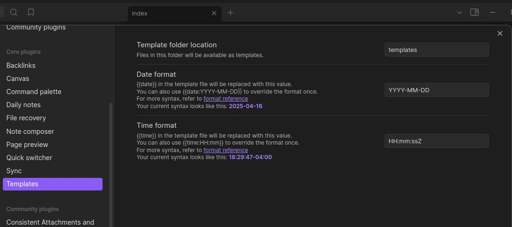

+++
title = "Continuous Blogging Pipeline"
date = 2025-04-16T18:55:28-04:00
author = "bryan"
draft = false
tags = ["obsidian"]
+++
# Continuous Blogging Pipeline

In a fit of spring cleaning I decided to overhaul this blog after nearly a decade, streamlining creation and publishing in a modern, programmatic, way. 

What started as a new way to take notes for my home lab and career studies quickly escalated into yet another personal tinker project that, if you're currently reading this, has actually progressed into production.

## Obsidian for notes! Obsidian for blogs?

I recently started studying for the CCIE Security, and wanted a way to centrally store and share my notes. This led me down the [obsidian](https://obsidian.md/) path, a wonderful productivity tool that stores notes in markdown. As these notes are in plain old markdown it's also very easy to sync your vault via git (expect a future post that goes through that whole process). This sparked a follow on idea, what if I could also use obsidian to draft and publish posts to my blog? As I only publish once in a blue moon and my content consists primarily of notes and how-to's, even word press was overkill as a platform. Why not simply type my notes in obsidian, pretty them up with a nice Hugo theme ([Terminal](https://github.com/panr/hugo-theme-terminal)), and push them to GitHub Pages? This would simplify publishing, cut down on my cloud resource consumption, and keep my posts backed up in a repository.

## The pipeline

I am, admittedly, not a clever man and could not have done this without help.


Photo Credit: https://www.buttersafe.com/2008/10/23/the-detour/

This workflow is heavily inspired by solumath's work that can be found here:
https://solumath.cz/posts/003-setting-up-blog/

It is more technical and in-depth then what follows here, so please visit their blog if you're looking to do something similar!
### Obsidian

The work flow starts with a new obsidian vault creatively called "Blog."

I then created the folders/directory structure for organizing posts, templates, misc. pages, and drafts.


Each post or draft starts with an individual folder, following a standard naming convention: "YYYY-MM-DD-Post-Title-With-No-Blank-Spaces"

In that folder will be an index.md containing the markdown file that will be published, along with any supporting attachments such as pictures.

I'm using the [Local Images Plus](https://github.com/Sergei-Korneev/obsidian-local-images-plus) community plugin to auto attach images in the same directory, renaming them to an md5 hash with no blank spaces (see the trend? regular markdown doesn't like the `%20` obsidian uses for blank spaces.

In the template folder I created a post.md file containing the [front matter](https://gohugo.io/content-management/front-matter/) supported by my [theme](https://github.com/panr/hugo-theme-terminal/blob/master/archetypes/posts.md) of choice. My obsidian settings also point to the templates folder for, well, templates.




To add the template to a draft or post, I simply open the obsidian command palette and insert the template, adding any changes like post title and tags.


After I'm happy with the contents of the post, I move the folder from drafts to posts.

## Hugo

I'm using Hugo to take the markdown and generate static web pages that will eventually be hosted on github pages. The nice thing about Hugo is we can run it locally and preview the content and themes and make sure everything looks good before publishing it.

In my home directory I initialized Hugo and created a new site structure called, creatively enough, "Blog."

Hugo's quick start guide should be enough to get that kicked off.

https://gohugo.io/getting-started/quick-start/

Next up was choosing a theme, and I instantly fell in love with this [Terminal](https://github.com/panr/hugo-theme-terminal) theme by Panr.

With Hugo configured, the next step is bringing over the posts in my obsidian posts folder to Hugo's "content" folder.

For that I'm simply using the [shell commands plugin ](https://github.com/Taitava/obsidian-shellcommands)with a custom entry called "Copy Blog" to copy the contents of posts to the content folder in the Hugo site directory structure.


Open the command palette, type copy blog, and everything should copy over.


From the Hugo site directory I just need to run `hugo` to generate my site or `hugo serve`
to locally preview things.


If everything looks good the next step is to commit and push the site contents to github.

```
git add -A
git commit -m "new blog post"
git push
```


I know I'm glossing over the git part, but hugo has a wonderful document on how to setup hosting with hugo and github pages found here:

https://gohugo.io/host-and-deploy/host-on-github-pages/

If you're looking to use a custom domain, see GitHubs document:

https://docs.github.com/en/pages/configuring-a-custom-domain-for-your-github-pages-site/about-custom-domains-and-github-pages

And that's really it, after pushing to github the workflow described in the link above will kick off and the site goes live!


I'm sure this pipeline will evolve as I continue down my obsidian journey and if that does just keep an eye out on my [repository](https://github.com/bryan-wrmem/bryan-wrmem.github.io)!


