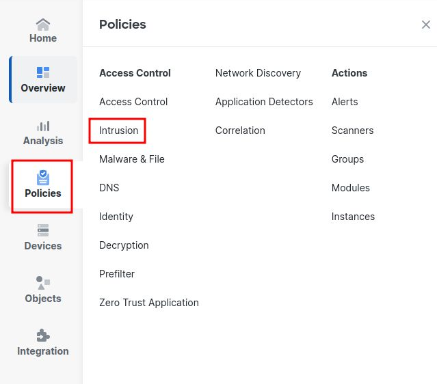
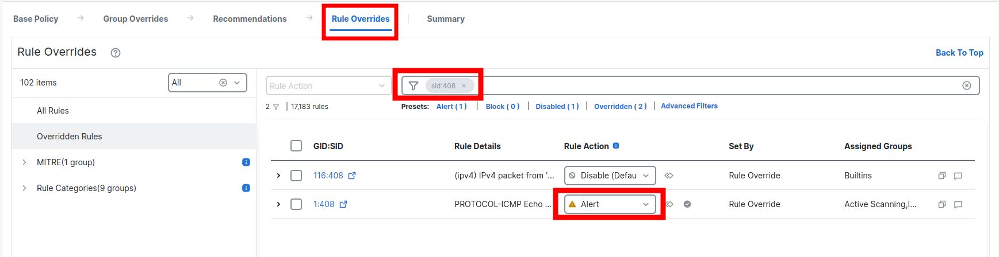
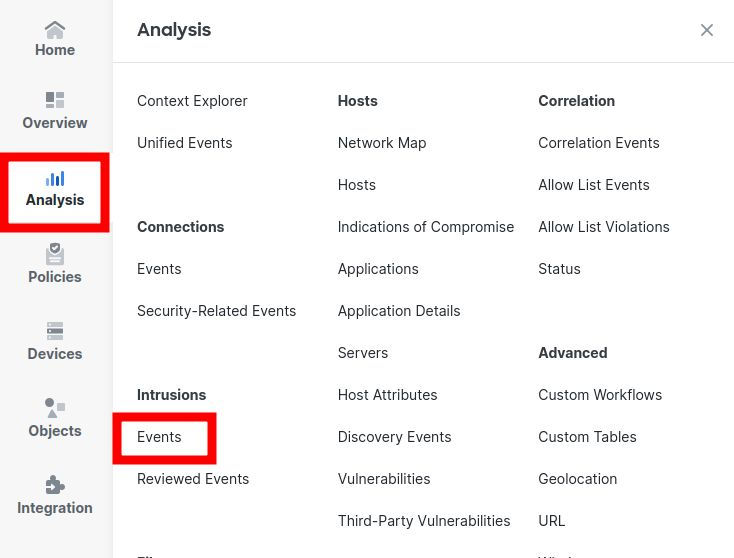
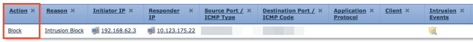

+++
title = "Testing Cisco Secure Firewall Snort IPS"
date = 2025-05-16T19:16:26-04:00
author = "bryan"
draft = false
tags = ["cisco","secure firewall","firepower"]
+++

Often when deploying Firepower/Secure Firewall devices I get asked to show that everything is working as expected or to prove that things like the Snort IPS engine are working as advertised.

I can't, in good conscience, attempt to download some malware or ransomware on their network but how about a simple ping?

Thankfully there's a built in Snort rule (sid) that can be enabled to trigger a security alert on ICMP Echo Replies, so all we need to do to highlight Snort efficacy and alerting is to enable that particular sid and send some Echo Requests and wait for the Reply.

First, let's edit the Intrusion policy by navigating to Policies > Intrusion

Find your main policy, and click Snort 2 or 3 depending on what you version you're using.

Click the Rule Overrides Tab, in the search bar search for sid:408

That should filter to the rule for PROTOCOL-ICMP ECHO

Hit the drop down and select the Alert action

Deploy your changes and then send a ping. Check the Intrusion Events dashboard and you should see some new events.

